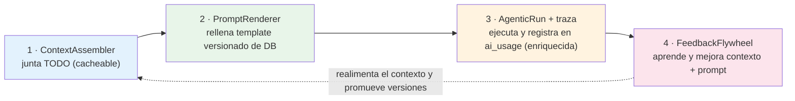
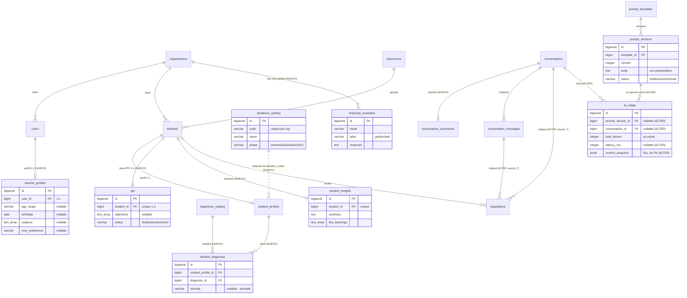
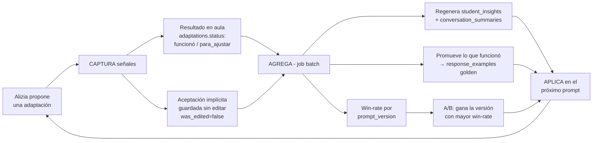

# Design Doc — Motor de Contexto, Trazabilidad y Self-Improvement de Alizia

## Índice

1. Problema
2. Visión
3. Estado actual
4. Principios de diseño
5. Decisiones de diseño
6. Arquitectura
7. Modelo de datos
8. El Context Assembler en detalle
9. **Prompts versionados en DB**
   - 9.1 Ciclo de vida
   - 9.2 Descomposición
   - 9.3 Catálogo de variables
   - 9.4 Los tres `body`
   - 9.5 Render por bloque
   - 9.6 Ejemplo renderizado
   - 9.7 Checklist y esqueletos (→ Apéndices A y B)
10. Loop de self-improvement (flywheel)
    - 10.1 Job batch (cron interno)
11. Privacidad y seguridad
12. Fases / roadmap
13. Métricas de éxito
14. Riesgos

**Apéndices**
- A — Checklist de contenido para los `body`
- B — Esqueletos de los tres `body`

> **Nota de organización.** El material de *autoría de contenido* (checklist + esqueletos) vive en
> los **Apéndices A y B** al final, separado del cuerpo de diseño. §9.7 deja una referencia.

---

## 1. Problema

Hoy Alizia responde casi exclusivamente en base al **catálogo de dispositivos** y a un
**perfil mínimo del alumno**. Los prompts son strings fijos en Go y el contexto que se
arma antes de cada llamada al modelo es chico. Falta casi todo lo que haría que la
respuesta sea realmente acertada:

- **No sabe con quién habla**: nada del docente (edad/rango, experiencia, materias, tono preferido).
- **No conoce bien al alumno**: solo nombre + `difficulties[]` libres + una descripción. No hay edad, grado, fortalezas, intereses, disparadores, ni diagnósticos estructurados.
- **No tiene memoria**: las sesiones previas con ese alumno existen en la tabla `conversations` pero no se resumen ni se inyectan. El historial viejo directamente **se descarta** por presupuesto de tokens (`history.go:capMessages`).
- **No usa los resultados**: las adaptaciones pasadas guardan `status` (`funcionó`/`para_ajustar`) y `outcome`, pero eso **nunca vuelve al prompt**.
- **No aprende**: no hay ninguna señal de qué respuesta fue buena o mala. No existe self-improvement.

La visión es lo opuesto: un **motor que junte la mayor cantidad de información posible**
(docente, aula, alumnos, historial, resultados, ejemplos que funcionaron) y la use para
que cada respuesta sea lo más acertada posible — y que **aprenda solo** de lo que funciona
en el aula.

---

## 2. Visión

> Alizia conoce a cada docente y a cada alumno, recuerda lo que pasó en sesiones
> anteriores, sabe qué adaptaciones funcionaron en el aula, y mejora sus respuestas con
> el tiempo sin intervención manual.

El "goal" concreto y medible se define después de cerrar este diseño (§12 propone fases).

---

## 3. Estado actual (cómo funciona hoy)

| Pieza | Archivo | Qué hace |
|---|---|---|
| Prompts | `src/core/usecases/inclusion/prompts.go` | 3 builders hardcodean el system prompt: `buildRecommendSystemPrompt`, `buildAssistSystemPrompt`, `buildGuidedAssistPrompt` |
| Parsing de salida | `prompts.go:191-229` | Regex extraen `[DEVICE_ID:X]`, `[STUDENT_ID:X]`, `[ADAPTATION_JSON:{...}]` |
| Loop agéntico | `agentic.go` | Tool-calling (máx 4 iteraciones). Tools: `list_classroom_students`, `get_student`, `list_devices` |
| Recomendación | `recommend_device.go` | Modo "recommend": arma prompt con catálogo + 1 alumno, una sola llamada |
| Asistente | `assist_classroom.go` | Modo "assist"/"guided": agéntico, con alumnos del aula |
| Historial | `history.go:capMessages` | Recorta por tokens (~3000). Preserva system + último turno, **tira lo viejo del medio** |
| Persistencia | `conversation.go` (entidad) | `conversations` + `conversation_messages` (con `metadata` jsonb) |
| Métricas | `ai_usage.go` | Tokens por org/usuario/modo. Alimenta el tablero del Director |

**Cuello de botella central:** prompts fijos + contexto mínimo + sin memoria + sin feedback.

---

## 4. Principios de diseño

1. **Máxima información, todo opcional.** Cada dato nuevo es nullable. Sirve la edad exacta *y* el rango etáreo, `difficulties[]` libres *y* diagnósticos estructurados. Alizia trabaja con lo que tenga y puede **sugerir** completar lo que falta.
2. **Orden cacheable (Anthropic prompt caching).** El prompt se arma con un **prefijo invariante por modo/org adelante** (persona + lineamientos + contrato + catálogo de dispositivos + vocabulario de situaciones) y lo **variable atrás** (few-shot por alumno + docente + perfil + historial + turno), con un **punto de corte de cache** entre ambos. El caching es match de prefijo exacto: cualquier valor dinámico —un campo `{{x}}` inline, un flag `{{#x}}`— que aparezca **antes** del corte invalida todo lo que sigue; por eso ninguno puede vivir en el prefijo estático (regla dura, §9.3) y el tono del docente se aplica desde su bloque (abajo), no interpolado en la persona. El few-shot, al seleccionarse por alumno (§9.3), queda **después** del corte. Esto baja costo 41–80% y mejora time-to-first-token. Es un requisito de arquitectura del Context Assembler, no un detalle.
3. **El prompt editable vive en DB y se versiona** (modelo OpenAI: versiones que no se pisan, A/B entre ellas, eval por versión). Lo que NO va a DB es el contrato de parsing y el motor de ensamblado (§6.1).
4. **Trazabilidad de punta a punta.** Cada llamada registra: qué versión de prompt, qué contexto (por IDs, no PII en claro), qué modelo, tokens, latencia, y a qué resultado llevó. Sin esto el self-improvement no tiene de dónde aprender.
5. **Aprender de la realidad, no de opiniones.** La señal de oro es **¿la adaptación funcionó en el aula?** (`adaptations.status`), seguida de la **aceptación implícita** (¿el docente la guardó sin editar?). No dependemos de que alguien apriete un pulgar.
6. **Privacidad por diseño.** Datos de menores + discapacidad = categoría especialmente protegida. Minimización donde se pueda, aislamiento por organización, IDs en logs. El control de acceso (RBAC) y el compliance legal los maneja otro equipo, fuera de scope de este servicio (§11).
7. **No romper Clean Architecture.** Entidades en `core/entities`, lógica en `core/usecases`, acceso a datos detrás de providers. Lo nuevo respeta esto.

---

## 5. Decisiones de diseño

> Cuatro definiciones que sostienen el resto del documento. Cada una se desarrolla abajo
> con su contexto, las alternativas que se descartaron y las consecuencias.

---

### Prompts editables en DB versionada

**Contexto.** Hoy el prompt de Alizia vive hardcodeado en código (`prompts.go`). Cada ajuste
de tono, lineamiento pedagógico o ejemplo few-shot exige un cambio de código + deploy, y no
hay forma de versionar, comparar (A/B) ni medir qué versión rinde mejor. Producto y las
psicopedagogas no pueden iterar sin pasar por el equipo de ingeniería.

**Decisión.** Separar el "prompt" en tres capas (ver §6.1) y mover **solo la capa editable**
a una tabla `prompt_versions` en DB: persona, tono, lineamientos, few-shot golden y
parámetros (`temperature`, `model`). Las versiones **no se pisan** (modelo OpenAI): se crea
una nueva y se promueve a `active`; las anteriores quedan para rollback y comparación. El
**contrato de salida** (formato `[ADAPTATION_JSON]`, tags) y el **motor de ensamblado** se
quedan en código, porque son lógica acoplada al parser, no texto editable.

**Alternativas descartadas.**
- *Todo en código (status quo).* Cero iteración sin deploy; no testeable A/B. Descartado.
- *Todo a DB, incluyendo contrato de salida.* Un edit mal hecho rompe el parsing en silencio
  en producción. Riesgo alto sin beneficio: el contrato casi no cambia. Descartado.
- *Archivos de prompt versionados en git (no DB).* Sigue requiriendo deploy y excluye a
  perfiles no técnicos. Descartado.

**Consecuencias.**
- ✅ Producto/pedagogía iteran el prompt sin deploy; A/B testing y eval por versión.
- ✅ Trazabilidad: cada run apunta a `prompt_version_id` (ver *Evolucionar `ai_usage` in-place*, más abajo).
- ⚠️ Hay que construir validación al publicar (placeholders presentes, no rompe contrato) y
  un fallback a "última versión buena" si la activa falla en runtime (§6.3).
- ✅ Sin UI de edición en la v1: editan solo devs vía query/seed. Menos
  superficie, menos ingeniería; producto pide cambios vía Claude Code y el dev los integra.

---

### Feedback por resultado en aula + aceptación implícita

**Contexto.** El self-improvement necesita una señal de "esto estuvo bien / mal" para
aprender. La opción obvia —un pulgar 👍/👎 explícito por mensaje— agrega UI, fricción y
produce una señal ruidosa (la gente no lo aprieta, o lo aprieta por motivos ajenos a la
calidad pedagógica).

**Decisión.** Usar dos señales que ya existen en el flujo real, sin pedirle nada extra al
docente:
1. **Resultado en el aula** (señal de oro): `adaptations.status` = `funcionó` / `para_ajustar`.
   Es el outcome real de la adaptación que Alizia ayudó a generar.
2. **Aceptación implícita**: ¿el docente guardó la adaptación propuesta **sin editarla**?
   (`was_edited=false`). Si la usó tal cual, fue buena; si la reescribió, algo faltó.

Sin pulgar explícito en la v1.

**Alternativas descartadas.**
- *Pulgar 👍/👎 explícito.* Más UI, señal escasa y sesgada. Se deja la puerta abierta
  (`message_feedback`) para una v2 si hace falta, pero fuera de v1.
- *Solo aceptación implícita (sin resultado de aula).* Pierde la señal más valiosa: que la
  cosa **funcionó con el chico**. Descartado.
- *Análisis manual de conversaciones.* No escala. Descartado.

**Consecuencias.**
- ✅ Señal honesta y de costo cero para el usuario; ata el aprendizaje al outcome real.
- ✅ Reusa datos que ya capturamos (`adaptations`).
- ⚠️ Señal con latencia: el `status` se marca días después de la conversación. El flywheel es
  batch, no tiempo real (consistente con *Evolucionar `ai_usage` in-place*).
- ⚠️ Hay que trazar el origen: `adaptations.source_conversation_id`/`source_message_id` +
  `was_edited` (migración 000015).

---

### Datos de menores: todo opcional + doble granularidad

**Contexto.** Para personalizar, Alizia gana mucho conociendo edad, diagnóstico y
características del alumno. Pero son **menores con datos de discapacidad** → categoría
especialmente protegida (GDPR art. 9 y equivalentes locales). No toda escuela tiene ni puede
compartir el mismo nivel de detalle, y forzar campos sería ilegal e impracticable.

**Decisión.** Todo dato nuevo del alumno es **nullable**. Se modela con **doble
granularidad** para que sirva con poco o con mucho:
- Edad: **exacta** (`birth_date`/`age`) *y* **rango etáreo**. Si solo hay rango, alcanza.
- Necesidades: `difficulties[]` (etiquetas libres, ya existe) *y* **diagnósticos
  estructurados opcionales** (catálogo). La capa de mayor detalle se llena solo si la escuela
  la brinda.

Alizia trabaja con lo que tenga y puede **sugerir** completar lo que falta, nunca exigirlo.

**Alternativas descartadas.**
- *Campos obligatorios y estructurados.* Inviable legal y operativamente; muchas escuelas no
  tienen el dato. Descartado.
- *Solo texto libre.* No es explotable para insights/agregación ni para filtros. Descartado.
- *Solo diagnóstico estructurado (sin texto libre).* Pierde matiz que el docente sí conoce.
  Descartado — por eso conviven ambos.

**Consecuencias.**
- ✅ Cumple minimización y opcionalidad; la escuela decide cuánto comparte.
- ✅ Sirve en el caso pobre (solo rango etáreo) y en el rico (diagnóstico estructurado).
- ⚠️ El motor de contexto y los prompts deben tolerar campos vacíos con elegancia (degradar,
  no romper).
- ✅ El catálogo de diagnósticos lo define Educabot y lleva `organization_id` desde el día uno
  (mismo catálogo global para todas las orgs por ahora; listo para per-org sin migración
  disruptiva).
- ➖ El control de acceso (RBAC) al exponer diagnósticos queda fuera de scope: lo cubre otro
  equipo. Acá solo habilitamos la carga del dato.

---

### Evolucionar `ai_usage` in-place

**Contexto.** Para el self-improvement necesitamos trazar cada turno: qué versión de prompt
corrió, qué modelo, latencia, tool calls, a qué conversación/mensaje pertenece y qué contexto
lo alimentó. La duda inicial fue crear una tabla nueva `ai_runs` para esto. Al leer el código
(`ai_usage.go`, `usage.go`, `get_ai_usage.go`, repo) se vio que `ai_usage` **ya escribe una
fila por turno** — exactamente el mismo grano que tendría `ai_runs`. `ai_runs` sería un
superset redundante.

**Decisión.** **No crear tabla nueva.** Evolucionar `ai_usage` in-place: agregarle columnas
de traza, **todas nullable**, vía `ALTER` (`conversation_id`, `message_id`,
`prompt_version_id`, `model`, `latency_ms`, `tool_calls`, `context_snapshot`). El nombre
`ai_usage` se mantiene (un rename sería una migración propia, fuera de scope). El tablero del
Director (`Summarize` → `GROUP BY mode`) ignora las columnas nuevas y **sigue igual**.

**Alternativas descartadas.**
- *Tabla nueva `ai_runs` + FK a `ai_usage`.* Dos tablas con el mismo grano = joins y doble
  escritura sin beneficio. Descartado.
- *Migrar `ai_usage` → `ai_runs` (rename + backfill).* Toca el tablero del Director y exige
  backfill de filas históricas. Riesgo alto, fuera de scope. Descartado.
- *JSONB único "trace" en una columna.* Pierde indexabilidad y tipado de `prompt_version_id`
  / `latency_ms`. Descartado salvo para `context_snapshot`, que sí es JSONB por naturaleza.

**Consecuencias.**
- ✅ Riesgo bajo y reversible: rollback = `DROP COLUMN`. Sin backfill (filas viejas → `NULL`).
- ✅ El tablero del Director no se toca; el índice `(organization_id, created_at)` ya sirve.
- ✅ Cumple las reglas de migración (immutable, rollback, sin PII: `context_snapshot` guarda
  IDs, no datos en claro).
- ⚠️ El nombre `ai_usage` queda algo angosto para lo que pasa a representar (traza completa).
  Se acepta la deuda de naming a cambio de cero riesgo.

---

## 6. Arquitectura

Cuatro piezas, en orden de flujo:



Mismo flujo en ASCII (por si el IDE no renderiza Mermaid en el preview):

```text
┌───────────────┐    ┌───────────────┐    ┌───────────────┐    ┌───────────────┐
│ 1 · Context   │ ─► │ 2 · Prompt    │ ─► │ 3 · Agentic   │ ─► │ 4 · Feedback  │
│   Assembler   │    │   Renderer    │    │   Run+traza   │    │   Flywheel    │
│ junta TODO    │    │ rellena el    │    │ ejecuta y     │    │ aprende y     │
│ el contexto   │    │ template de   │    │ registra en   │    │ mejora ctx +  │
│ (cacheable)   │    │ DB versionado │    │ ai_usage      │    │ prompt        │
└───────────────┘    └───────────────┘    └───────────────┘    └───────┬───────┘
        ▲                                                              │
        └──────── realimenta el contexto y promueve versiones ◄────────┘
```

### 6.1 Las tres capas de un "prompt" (el reframe del híbrido)

| Capa | Qué incluye | Dónde vive | Por qué |
|---|---|---|---|
| **1. Contenido editable** | Persona, tono, lineamientos pedagógicos, few-shot golden, `temperature`, `model` | **DB** (`prompt_versions`) | Alta iteración; un dev lo ajusta vía query/seed sin deploy ni cambio de código; A/B testeable |
| **2. Contrato de salida** | Formato `[ADAPTATION_JSON:{...}]`, tags `[DEVICE_ID:X]`/`[STUDENT_ID:X]` | **Código** (o DB validado) | Acoplado al parser (`prompts.go:191-193`). Editarlo mal rompe el parsing en silencio. No urgente externalizar |
| **3. Motor + contexto** | Orden de bloques (caching), inyección de datos en runtime | **Código** | Es lógica, no texto. Nunca fue un "template" |

> Vamos full DB para la capa 1. Las capas 2 y 3 no son "prompt" en el sentido editable.

### 6.2 Context Assembler

Nuevo usecase `BuildPromptContext(ctx, orgID, userID, classroomID, studentID, mode)` que
devuelve un struct tipado con TODO el contexto disponible. Orden pensado para caching:

```go
type PromptContext struct {
    // ---- ESTÁTICO (va al frente del prompt → cacheable) ----
    Persona     PersonaConfig       // de prompt_versions (tono, lineamientos)
    DeviceCatalog []DeviceContext   // catálogo de la org (cambia poco)
    FewShot     []ResponseExample   // golden filtrados por modo

    // ---- DINÁMICO (va al final → no cacheable) ----
    Teacher       *TeacherContext   // rango/edad, experiencia, materias, tono (incl. maestra integradora)
    Classroom     ClassroomContext  // nombre, grado, sección, # alumnos
    Students      []StudentContext  // del aula: nombre, edad, perfil resumido
    TargetStudent *StudentContext   // alumno foco: perfil + situaciones observables + diagnósticos
    PPI           *PPIContext       // objetivos + adaptaciones curriculares, si existe
    Environment   *EnvironmentContext // familia / profesionales / acompañante terapéutico
    PastOutcomes  []AdaptationOutcome // adaptaciones previas + cómo salieron
    Insights      *StudentInsights  // memoria acumulada del alumno
    Summary       string            // resumen de la conversación (en vez de tirar historial)
    RecentTurns   []ChatMessage     // últimos turnos crudos
}
```

**Tools nuevas para el loop agéntico** (`agentic.go`), para que el modelo pueda
profundizar bajo demanda sin inflar el prompt base:

- `get_student_history(student_id)` → resumen de sesiones previas con ese alumno.
- `get_past_adaptations(student_id)` → adaptaciones pasadas + `status`/`outcome`.
- `get_student_insights(student_id)` → memoria acumulada (qué funciona / qué no).

### 6.3 Prompt Renderer

Toma la versión activa (`prompt_versions.status='active'` por `template.key`) y la rellena
con el `PromptContext`. Es un **motor de templates estilo Mustache/Handlebars** (lib Go
probada, p. ej. `raymond` — no inventamos sintaxis) que soporta los **tres tipos de
placeholder** del §9.3: bloque, campo y flag. Requisitos:

- **Cache en memoria** de la versión activa (no leer DB en cada request).
- **Validación al publicar**: el body debe tener los placeholders esperados, todo
  `{{path}}` debe existir en el catálogo (§9.3), las secciones `{{#flag}}…{{/flag}}` deben
  cerrar balanceadas, el `{{output_contract}}` no se puede sobreescribir, y **ningún campo
  `{{x}}` ni flag `{{#x}}` puede aparecer antes del marcador de corte de cache** (prefijo
  invariante, §8/§9.3). Si algo falla, no se activa.
- **Fallback**: si la versión activa falla en runtime, caer a la "última versión buena conocida" (o al prompt de código como red de seguridad).

### 6.4 Agentic Run + traza

El loop de `agentic.go` se mantiene. Se le suma: al terminar el turno, `recordAIUsage`
(`usage.go`) escribe la fila en `ai_usage` ya enriquecida con `prompt_version_id`, `model`,
`latency_ms`, `tool_calls`, `conversation_id`/`message_id` y `context_snapshot` (IDs de
student/classroom/profile que alimentaron el prompt — **sin PII en claro**). Sigue siendo
*best-effort* (no bloquea la respuesta).

### 6.5 Feedback Flywheel

Ver §10.

---

## 7. Modelo de datos

Tablas nuevas y `ALTER`s, agrupados por capa. DBML (para `db/schema.dbml` / dbdiagram.io)
al final de la sección.

### Capa A — Enriquecer docente y alumno

**`teacher_profiles`** (1:1 con `users`): contexto del docente.
- `age_range` *y* `birthdate` ambos nullable (doble granularidad).
- `years_experience`, `specialization`, `subjects text[]`, `tone_preference`, `bio`.

**`students`** (ALTER): `birthdate date [null]`, `age_range varchar [null]`, `grade_level varchar [null]`, `preferred_name varchar [null]`.

**`student_profiles`** (ALTER, todo nullable): `support_level`, `strengths text[]`, `interests text[]`, `triggers text[]`, `effective_strategies text[]`, `ineffective_strategies text[]`, `situation_codes text[]` (vocabulario controlado del `situations_catalog`), `has_therapeutic_companion boolean`, `environment_notes text` (familia / profesionales externos / acompañante terapéutico — contexto del entorno, Eje 3). Se mantiene `difficulties[]` libre.

**`situations_catalog`**: taxonomía de **situaciones observables de aula** (las ~15 del MVP: "no inicia la tarea", "se distrae constantemente", etc.). Es la **entrada pedagógica primaria** ("entrada pedagógica, no clínica"): se parte de lo observable, no del diagnóstico. Global, definido por Educabot, con `organization_id` para per-org futuro (mismo criterio que `diagnoses_catalog`).

**`diagnoses_catalog`** + **`student_diagnoses`**: capa estructurada de mayor detalle, opcional y **secundaria** a las situaciones. Solo se llena si la escuela brinda diagnóstico. Alizia puede sugerir etiquetas.

**`ppi`** (Proyecto Pedagógico Individual, 1 por alumno): objetivos, adaptaciones curriculares y seguimiento. Lo crea el docente (a partir de informes terapéuticos) y lo valida el Director. Es **contexto de primera línea**: cuando existe, Alizia asiste en redacción de objetivos y mantiene coherencia con él (Eje 1 — equidad con ajustes proporcionales; Eje 3 — apoyo en diseño e implementación de PPI). Todos los campos nullable; el PPI puede no existir.

> **Roles (`member_role`).** El MVP suma **maestra integradora**, hoy ausente del enum (`teacher`, `coordinator`, `admin`, `ministerio`, `psicopedagogo`). Tiene acciones propias sobre su **alumno asignado** (ver/editar perfil y adaptación, usar Alizia). El motor de contexto necesita saber con quién habla, así que el modelado de roles debe incluirla y modelar la asignación integradora↔alumno. El RBAC en sí sigue fuera de scope (otro equipo) — acá solo habilitamos que el dato exista y llegue al prompt.

### Capa B — Memoria

**`conversation_summaries`** (1:1 con `conversations`): resumen comprimido para no tirar historial viejo en `capMessages`.

**`student_insights`** (1 por alumno): memoria viva — `summary` + `key_learnings text[]`, regenerada por job batch desde sesiones + adaptaciones.

### Capa C — Feedback y trazabilidad

**`adaptations`** (ALTER): `source_conversation_id`, `source_message_id` (liga la sugerencia de IA con su resultado real), `was_edited boolean` (¿el docente la modificó antes de guardar? → señal de aceptación implícita). Ya existen `status` (`en_curso`/`funcionó`/`para_ajustar`) y `outcome` = el resultado en aula.

**`response_examples`**: banco de ejemplos golden/bad. Los golden se inyectan como few-shot y sirven de set de evaluación. Dos orígenes (`source`): **`curated`** = las **adaptaciones base de los ~15 casos del MVP**, curadas por Educabot — son el seed de cold-start, ligadas a su `situation_code` vía `tags`; **`from_outcome`** = promovidos por el flywheel desde adaptaciones que `funcionó` en aula. El `curated` da valor desde el día uno; el `from_outcome` mejora con el uso.

> Nota: `message_feedback` (pulgar explícito) queda **fuera de la v1** (ver *Feedback por resultado en aula + aceptación implícita*, §5). Se deja
> el diseño previsto por si se agrega después, pero no se construye ahora.

### Capa D — Prompts versionados y runs

**`prompt_templates`** + **`prompt_versions`**: el contenido editable de los prompts, versionado (modelo OpenAI).

**`ai_usage`** (ALTER, NO tabla nueva): se le suman columnas de traza nullable. Mismo grano que hoy (una fila por turno), así que el tablero del Director (`get_ai_usage.go`) sigue funcionando sin cambios y las filas viejas quedan con los campos nuevos en `NULL`. Ver *Evolucionar `ai_usage` in-place* (§5).

### DBML

```dbml
// ============ CAPA A ============
Table teacher_profiles {
  id bigserial [pk, increment]
  user_id bigint [ref: - users.id, not null]      // 1:1
  organization_id uuid [ref: > organizations.id, not null]
  birthdate date [null]
  age_range varchar [null]        // doble granularidad: la que tengan sirve
  years_experience integer [null]
  specialization varchar [null]
  subjects "text[]" [null]
  tone_preference varchar [null]  // cercano / formal / directo
  bio text [null]
  created_at timestamp
  updated_at timestamp
  Note: "Contexto del docente para personalizar tono y nivel de la IA"
}

// ALTER students:
//   + birthdate date [null]
//   + age_range varchar [null]
//   + grade_level varchar [null]
//   + preferred_name varchar [null]

// ALTER student_profiles (todo nullable):
//   + support_level varchar
//   + strengths "text[]"
//   + interests "text[]"
//   + triggers "text[]"
//   + effective_strategies "text[]"
//   + ineffective_strategies "text[]"
//   + situation_codes "text[]"          // vocabulario controlado de situations_catalog
//   + has_therapeutic_companion boolean
//   + environment_notes text            // familia / profesionales / acompañante terapéutico

Table situations_catalog {
  id bigserial [pk, increment]
  organization_id uuid [ref: > organizations.id, null] // null = global (definido por Educabot)
  code varchar [not null]         // ej: no_inicia_tarea, se_distrae, se_desregula
  name varchar [not null]
  description text [null]
  phase varchar [null]            // preventiva / durante / cierre — nullable; se llena si/cuando el contenido pedagógico la clasifique (sin consumidor hoy, no bloquea)
  sort_order integer [not null, default: 0]
  indexes { (organization_id, code) [unique] }
  Note: "Situaciones observables de aula (las ~15 del MVP). Entrada pedagógica primaria, no clínica"
}

Table ppi {
  id bigserial [pk, increment]
  organization_id uuid [ref: > organizations.id, not null]
  student_id bigint [ref: - students.id, not null]  // 1:1
  objectives "text[]" [null]
  curricular_adaptations text [null]
  follow_up text [null]                              // seguimiento de avances
  status varchar [not null, default: "draft"]        // draft / active / archived
  created_by bigint [ref: > users.id, null]          // docente que lo crea
  validated_by bigint [ref: > users.id, null]        // director que lo valida
  created_at timestamp
  updated_at timestamp
  indexes { student_id [unique] }
  Note: "Proyecto Pedagógico Individual. Contexto de primera línea cuando existe. Todo opcional"
}

Table diagnoses_catalog {
  id bigserial [pk, increment]
  organization_id uuid [ref: > organizations.id, null] // null = global
  name varchar [not null]
  category varchar [null]
  Note: "Taxonomía de diagnósticos. Capa secundaria a situations_catalog. Opcional"
}

Table student_diagnoses {
  id bigserial [pk, increment]
  student_profile_id bigint [ref: > student_profiles.id, not null]
  diagnosis_id bigint [ref: > diagnoses_catalog.id, not null]
  severity varchar [null]
  notes text [null]
  created_at timestamp
  indexes { (student_profile_id, diagnosis_id) [unique] }
  Note: "Diagnósticos estructurados (dato sensible — ver §11). Opcional"
}

// ============ CAPA B ============
Table conversation_summaries {
  conversation_id bigint [pk, ref: - conversations.id] // 1:1
  summary text
  token_count integer [default: 0]
  updated_at timestamp
  Note: "Resumen comprimido. Evita tirar historial viejo en capMessages"
}

Table student_insights {
  id bigserial [pk, increment]
  organization_id uuid [ref: > organizations.id, not null]
  student_id bigint [ref: > students.id, not null]
  summary text
  key_learnings "text[]"
  source varchar [default: "ai_generated"]
  updated_at timestamp
  indexes { student_id [unique] }
  Note: "Memoria viva por alumno. Job batch la regenera de sesiones+adaptaciones"
}

// ============ CAPA C ============
// ALTER adaptations:
//   + source_conversation_id bigint [ref: > conversations.id, null]
//   + source_message_id bigint [ref: > conversation_messages.id, null]
//   + was_edited boolean [default: false]
//   (ya existen status + outcome = resultado real en aula)

Table response_examples {
  id bigserial [pk, increment]
  organization_id uuid [ref: > organizations.id, null] // null = global
  mode varchar [not null]
  context_snapshot jsonb [default: "{}"]
  response text
  label varchar [not null]        // golden / bad
  tags "text[]"
  source varchar                  // curated / from_outcome
  created_at timestamp
  Note: "Few-shot golden + set de eval. Lo alimenta el flywheel"
}

// ============ CAPA D ============
Table prompt_templates {
  id bigserial [pk, increment]
  key varchar [not null]          // recommend / assist / guided
  name varchar
  indexes { key [unique] }
}

Table prompt_versions {
  id bigserial [pk, increment]
  template_id bigint [ref: > prompt_templates.id, not null]
  version integer [not null]
  body text                       // con {{placeholders}}
  model varchar [null]
  params jsonb [default: "{}"]
  status varchar [default: "draft"] // draft / active / archived
  created_at timestamp
  indexes { (template_id, version) [unique] }
  Note: "Contenido editable del prompt, versionado. Modelo OpenAI: A/B entre versiones"
}

// ALTER ai_usage (NO tabla nueva — ver §5). Columnas de traza, todas nullable:
//   + conversation_id bigint [ref: > conversations.id, null]
//   + message_id bigint [ref: > conversation_messages.id, null]
//   + prompt_version_id bigint [ref: > prompt_versions.id, null]
//   + model varchar [null]
//   + latency_ms integer [default: 0]
//   + tool_calls integer [default: 0]
//   + context_snapshot jsonb [default: "{}"]   // IDs, NO PII en claro
//   (ya existen: org, user, mode, prompt/completion/total_tokens, created_at)
//   El índice (organization_id, created_at) ya existe y sirve al tablero del Director.
```

### 7.1 Diagrama entidad-relación (nuevo + existente)

> Verde = tablas nuevas · Gris = tablas existentes que se modifican (ALTER). El resto del
> esquema actual (`db/schema.dbml`) se mantiene igual.



---

## 8. El Context Assembler en detalle

Orden de armado del prompt final (clave para caching):

```
┌─ PREFIJO INVARIANTE (cacheable por modo/org, va primero) ─┐
│ 1. Persona + lineamientos pedagógicos  (prompt_versions)  │
│    (tono base literal; la preferencia del docente se      │
│     aplica desde el bloque 7, no se interpola acá)         │
│ 2. Contrato de salida                   (código)          │
│ 3. Catálogo de devices                  (DeviceProvider)  │
│ 4. Vocabulario de situaciones           (situations_catalog)│
├─ ✂ PUNTO DE CORTE DE CACHE ───────────────────────────────┤
│ 5. Few-shot golden (por situación)      (response_examples)│
├─ VARIABLE (no cacheable entre alumnos, va al final) ──────┤
│ 6. Docente (rango/edad, materias, tono) (teacher_profiles)│
│ 7. Aula + alumnos                       (classroom+students)│
│ 8. Alumno foco: perfil + situaciones    (student_profiles) │
│    observables + diagnósticos                              │
│ 9. PPI: objetivos + adaptación curric.  (ppi, si existe)  │
│ 10. Entorno: familia / acompañante terap.(environment)    │
│ 11. Adaptaciones previas + resultado    (adaptations)     │
│ 12. Insights del alumno                 (student_insights)│
│ 13. Resumen + últimos turnos            (conversation_summaries)│
│ 14. Turno actual del docente                              │
└──────────────────────────────────────────────────────────┘
```

El **few-shot** queda apenas después del corte a propósito: es estable dentro de una
conversación (cachea turno-a-turno) pero **cambia entre alumnos** (se filtra por
`situation_code`, §9.3), así que no integra el prefijo invariante. Cuanto más de los bloques
6–13 falte (todo opcional), Alizia trabaja con lo que hay y puede sugerir completar — clave
para el onboarding rápido ("valor desde la primera conversación"). El docente nunca queda
bloqueado por datos faltantes.

---

## 9. Prompts versionados en DB

> **Contenido fuente de la v1.** El `body` de la primera versión sale de los **lineamientos
> del MVP**: los 3 ejes (principios pedagógicos, de funcionamiento y de uso) y los Criterios
> de AliZia (marco DUA + diferenciación, tipo de conocimiento, **límites duros** — no
> diagnostica, no reemplaza al docente, no produce informes clínicos — y finalidad
> operativa). De ahí salen también las reglas de formato de salida: 1–3 acciones ordenadas
> por impacto, mínimo 3 niveles de diferenciación, respuesta útil en <1 min. Ese texto vive
> en `prompt_versions`, no hardcodeado.

Flujo basado en el modelo de OpenAI (versiones que no se pisan, A/B, eval por versión):

1. **Crear/editar** una versión (`draft`) — sin UI: lo hace un dev vía query / seed por script de entorno (ver *Prompts editables en DB versionada*, §5).
2. **Validar** al intentar publicar: placeholders presentes, contrato de salida intacto.
3. **Publicar** → `status='active'` (archiva la anterior). Se cachea en memoria.
4. **A/B**: dos versiones activas con split de tráfico, comparadas por win-rate (§10).
5. **Eval por versión** (Anthropic corre evals en cada cambio de system prompt): antes de promover, correr el set de `response_examples` y comparar.

**Riesgos y mitigaciones:** texto en DB puede romper runtime → validación al publicar +
fallback a última versión buena + red de seguridad en código. Releer DB es caro → cache
en memoria con invalidación al publicar.

**Edición → publicación → runtime** (por qué un prompt mal editado no rompe producción):

```text
   EDICIÓN         VALIDACIÓN        PUBLICACIÓN        RUNTIME
 ┌────────┐      ┌────────────┐    ┌────────────┐    ┌────────────┐
 │ dev    │ ──►  │ al publicar│──► │ active     │──► │ render por │ ──► modelo
 │ crea/  │      │ (4 checks) │    │ archiva la │    │ turno con  │
 │ edita  │      │            │    │ anterior + │    │ versión    │
 │ draft  │      │            │    │ cachea     │    │ cacheada   │
 └────────┘      └─────┬──────┘    └────────────┘    └─────┬──────┘
                       │ falla un check                    │ falla en runtime
                       ▼                                    ▼
                ✗ NO se activa                        FALLBACK → última
                (sigue corriendo                      versión buena →
                 la versión activa)                   red en código

 Los 4 checks de validación:  (1) cada {{x}} existe en el catálogo (§9.3)
                              (2) flags {{#x}}…{{/x}} balanceados
                              (3) {{output_contract}} intacto (capa 2, no editable)
                              (4) nada dinámico antes del corte de cache

 Rollback: volver a promover una versión vieja a active (nunca se pisó ninguna).
```

### 9.1 Ciclo de vida de la conversación: prompt y variables por etapa

> El prompt no es un bloque que se usa una sola vez. La conversación tiene **etapas**, y en
> cada una **cambia qué variables del `PromptContext` (§6.2) son protagonistas** y qué se
> espera que Alizia produzca. Esta es la vista "desde el saludo hasta crear la adaptación y
> sus respuestas". Importante: técnicamente **no hay un prompt por etapa** — hay **un único
> system prompt versionado por modo**, ensamblado por turno (§8), cuyo `body` contiene las
> instrucciones de todas las etapas; lo que varía turno a turno es **qué placeholders vienen
> llenos** y, por lo tanto, en qué etapa "cae" la respuesta.

| # | Etapa | Disparador | Qué hace Alizia | Variables protagonistas | Salida esperada |
|---|---|---|---|---|---|
| 0 | **Saludo / apertura** | Inicio de conversación (sin turno del docente todavía) | Saluda, ancla el contexto (docente, alumno foco si lo hay) y **retoma la memoria previa** ("¿seguimos con lo de Juan?") | `{{teacher}}`, `{{target_student}}`, `{{insights}}`, `{{conversation_summary}}`, `{{past_outcomes}}` | Mensaje de bienvenida personalizado. **Sin** `[ADAPTATION_JSON]` |
| 1 | **Recopilación** | Faltan datos (típico de modo `guided`) | Una pregunta por vez para completar alumno / materia / **situación observable** | `{{classroom_students}}`, `{{target_student}}` (parcial), `{{situations_catalog}}` | Preguntas. **Sin** JSON |
| 2 | **Propuesta de adaptación** | Hay info suficiente | Genera 1–3 acciones ordenadas por impacto + ≥3 niveles de diferenciación + dispositivos | `{{device_catalog}}`, `{{target_student}}` (completo + `{{ppi}}` + `{{environment}}`), `{{few_shot}}`, `{{past_outcomes}}` | Respuesta + `[ADAPTATION_JSON]` + `[DEVICE_ID]` / `[STUDENT_ID]` |
| 3 | **Iteración / ajuste** | El docente pide cambios | Refina la propuesta sin volver a preguntar lo ya respondido | `{{recent_turns}}`, `{{conversation_summary}}` + todo lo de la etapa 2 | Respuesta ajustada (+ JSON si re-genera) |
| 4 | **Cierre / guardado** | El docente acepta y guarda | Confirma; queda la **traza** (`source_message_id`, `was_edited`) | — | Confirmación. Dispara la captura de señales del flywheel (§10) |

**Mapeo etapa ↔ modo** (los modos no recorren todas las etapas):

| Modo (`prompt_templates.key`) | Etapas que recorre | Nota |
|---|---|---|
| `recommend` | Salta directo a **2** (one-shot) | Sin saludo ni recopilación; system + user prompt, una sola llamada |
| `assist` | **2–3**, turnos breves | "Durante la clase": prioriza brevedad; el saludo es mínimo o inexistente |
| `guided` | **0 → 1 → 2 → 3 (→ 4)** | El flujo completo; es donde el ciclo de vida se ve entero |

**Vista de flujo** (resume visualmente las dos tablas de arriba):

```text
┌─ FLUJO DE LA CONVERSACIÓN · etapas 0 → 4 ──────────────────────────────┐
│                                                                        │
│  0 Saludo ─► 1 Recopilación ─► 2 Propuesta ─► 3 Iteración ─► 4 Cierre  │
│  retoma       una pregunta      1–3 acciones    ajusta sin    guarda +  │
│  memoria      por vez           + [JSON]        re-preguntar  traza      │
│  (sin JSON)   (sin JSON)        + devices                     (→ señal   │
│                                                              flywheel)   │
└────────────────────────────────────────────────────────────────────────┘

   Qué etapas recorre cada modo (no todos hacen el ciclo entero):

   recommend │  ───────────────►【2】                  one-shot: salta a Propuesta
   assist    │              【2】⇄【3】                 durante la clase: turnos breves
   guided    │  【0】►【1】►【2】⇄【3】►(【4】)          el ciclo completo
```

> **El saludo (etapa 0) hoy no existe como etapa propia.** En el código actual la conversación
> arranca con el system prompt + el primer mensaje del docente; no hay una apertura donde Alizia
> **use la memoria** para anclar ("la última vez con Juan probamos X, ¿seguimos?"). Es justo el
> turno donde `student_insights` y `conversation_summary` (Capa B, §7) pagan por primera vez.
>
> **Decisión: el saludo es texto de plantilla con flags** (`{{#is_first_session}}`,
> `{{#has_memory}}` — ver §9.3), no un turno generado por el modelo. Costo y latencia cero (no
> gasta una llamada solo para abrir), determinístico/testeable, y editable por contenido sin
> deploy (alineado con *Prompts editables en DB versionada*, §5). Se descartó "que lo genere el modelo" (más natural pero cuesta
> una llamada extra y puede alucinar memoria inexistente). El contenido controla la apertura con
> los flags; el ejemplo está en §9.4.

### 9.2 Descomposición de los prompts actuales en las 3 capas

Tomando los 3 builders reales de `prompts.go` y separándolos según §6.1 (capa 1 editable → DB ·
capa 2 contrato → código · capa 3 contexto dinámico → variables):

| Prompt (builder actual) | Capa 1 — editable (→ `prompt_versions.body`) | Capa 2 — contrato (código, fijo) | Capa 3 — variables dinámicas |
|---|---|---|---|
| `buildRecommendSystemPrompt` | Persona ("Sos Alizia…"), `LINEAMIENTOS` (5 bullets), `FORMATO DE RESPUESTA` (prosa), línea de tono | `[DEVICE_ID:X]`, `[ADAPTATION_JSON:{…}]`, enum de `type` válido | `{{device_catalog}}` |
| `buildRecommendUserPrompt` | (no aplica — es el turno del docente) | — | `{{user_turn}}` = `subject` · `objective` · `duration` · `dynamic` · `materials` + `{{target_student}}` |
| `buildAssistSystemPrompt` | Persona ("…en tiempo real / DURANTE la clase"), `LINEAMIENTOS`, tono | `[STUDENT_ID:X]`, `[DEVICE_ID:X]`, `[ADAPTATION_JSON]`, enum `type`, regla "solo incluí el bloque si hay adaptación concreta" | `{{classroom_students}}`, `{{device_catalog}}` |
| `buildGuidedAssistPrompt` | Persona, `FLUJO GUIADO` (4 pasos = etapas 1–2), `IMPORTANTE` (una pregunta por vez, no re-preguntar, tono) | `[STUDENT_ID:X]`, `[DEVICE_ID:X]`, `[ADAPTATION_JSON]` | `{{classroom_students}}`, `{{device_catalog}}` |

Observaciones del análisis:
- **Lo dinámico hoy es pobre**: solo catálogo + lista de alumnos con `difficulties[]`. Todo el
  contexto nuevo (docente, situaciones, PPI, entorno, outcomes, insights, memoria) son
  **placeholders que aún no existen** — los agrega el Context Assembler (§6.2, §8).
- **El contrato de salida (capa 2) está mezclado** dentro del texto del prompt en los 3 builders.
  Al versionar, ese bloque se reemplaza por un **marcador `{{output_contract}}` que rellena el
  renderer desde código** (§5): el editor del prompt no puede romper el parser.
- **`recommend` separa system y user prompt**; en el modelo versionado, el `body` versionado es
  el **system prompt**, y el turno del docente entra por `{{user_turn}}` (con sus sub-campos
  estructurados en modo `recommend`).

### 9.3 Catálogo de variables (placeholders)

El `body` versionado se rellena desde el `PromptContext` (§6.2). El motor (§6.3) expone **tres
tipos de placeholder** para que el contenido (producto/pedagogía) pueda escribir tanto
estructura como prosa natural y comportamiento condicional, sin tocar Go (§5):

| Tipo | Sintaxis | Qué inyecta | Para qué lo usa el contenido |
|---|---|---|---|
| **Bloque** | `{{target_student}}` | Sección entera formateada por el renderer (§9.5) | Volcar contexto estructurado |
| **Campo** | `{{target_student.preferred_name}}` | Un valor suelto, inline | Prosa natural ("trabajemos con **Juan**") |
| **Flag** | `{{#is_first_session}}…{{/is_first_session}}` | Nada — muestra/oculta el texto entre marcas | Comportamiento condicional (saludo, etapas) |

> **Decisión (extiende *Prompts editables en DB versionada*).** Se adopta motor de templates con los tres tipos. Da el
> máximo de iteración al contenido sin deploy. Alternativas descartadas: *solo bloques* (no
> permite prosa personalizada, choca con el tono cálido del MVP); *bloque+campo sin flags*
> (deja el saludo y las etapas en código, iteración parcial). El costo es un renderer más rico
> y validación al publicar más estricta (§6.3) — se acepta.

**Catálogo de bloques.** Orden de inyección según §8 (estático adelante = cacheable, dinámico
atrás). La columna **degradación** define qué pasa cuando el dato falta (§5, datos opcionales:
degradar sin romper).

| Bloque | Fuente (`PromptContext`) | Caching | Degradación si falta | Tope (presupuesto) | Etapas |
|---|---|---|---|---|---|
| `{{output_contract}}` | — (código, capa 2) | prefijo | nunca falta (fijo) | fijo | 2, 3 |
| `{{device_catalog}}` | `DeviceCatalog` | prefijo | catálogo vacío → sugiere sin device | catálogo de la org | 2 |
| `{{situations_catalog}}` | catálogo (vocabulario) | prefijo | omite → Alizia infiere en texto libre | lista corta de códigos | 1 |
| `{{few_shot}}` | `FewShot` | **tras el corte** (por alumno) | sin ejemplos → solo lineamientos (cold-start, §14) | top-3 por relevancia | 2 |
| `{{teacher}}` | `Teacher` | dinámico | omite bloque; tono por defecto | 1 línea | 0, 2 |
| `{{classroom}}` | `Classroom` | dinámico | omite grado/sección | 1 línea | 1, 2 |
| `{{classroom_students}}` | `Students` | dinámico | lista vacía → solo el foco | top-N alumnos | 1 |
| `{{target_student}}` | `TargetStudent` | dinámico | sin foco → pregunta para quién es (etapa 1) | perfil completo | 0, 1, 2, 3 |
| `{{ppi}}` | `PPI` | dinámico | omite bloque (PPI puede no existir) | resumido | 2 |
| `{{environment}}` | `Environment` | dinámico | omite bloque | 1–2 líneas | 2 |
| `{{past_outcomes}}` | `PastOutcomes` | dinámico | omite; sin historial | top-3 recientes | 0, 2 |
| `{{insights}}` | `Insights` | dinámico | omite; sin memoria | resumen + key_learnings | 0, 2 |
| `{{conversation_summary}}` | `Summary` | dinámico | vacío en la 1ª sesión | resumen comprimido | 0, 3 |
| `{{recent_turns}}` | `RecentTurns` | dinámico | solo el turno actual | últimos N turnos | 3 |
| `{{user_turn}}` | turno actual | dinámico | vacío en la etapa 0 (saludo) | turno actual | 1, 2, 3 |

**Campos expuestos para uso inline** (subconjunto seguro; el contenido los escribe en prosa):

| Campo | Origen | Default si vacío |
|---|---|---|
| `{{teacher.first_name}}` | `Teacher.Name` | "profe" |
| `{{teacher.tone_preference}}` | `Teacher.TonePreference` | "cálido y profesional" |
| `{{target_student.preferred_name}}` | `TargetStudent` (preferred_name → name) | (omite la frase con flag) |
| `{{target_student.age}}` | derivado: `birthdate` → edad, fallback `age_range` | — |
| `{{classroom.grade}}` / `{{classroom.section}}` | `Classroom` | — |
| `{{classroom.student_count}}` | derivado: `len(Students)` | "0" |

**Flags (booleanos que computa el renderer, no salen directo de DB):**

| Flag | Verdadero cuando… | Uso típico |
|---|---|---|
| `{{#is_first_session}}` | no hay `conversation_summary` del alumno | presentarse vs. retomar (etapa 0) |
| `{{#has_target_student}}` | hay alumno foco | saltar la pregunta "¿para quién?" |
| `{{#has_memory}}` | hay `insights` o `past_outcomes` | anclar el saludo en lo que ya funcionó |
| `{{#has_ppi}}` | el alumno tiene PPI | mencionar/mantener coherencia con objetivos |
| `{{time_of_day}}` | (campo derivado) | "buenos días/tardes" en la apertura |

> **Reglas transversales.**
> - **Degradación uniforme:** un bloque/campo nullable vacío **se omite entero** (sin header,
>   sin "N/A"). Donde aporte, Alizia **sugiere completar** el dato (principio 1, §4) en vez de
>   bloquearse.
> - **Selección del few-shot:** `{{few_shot}}` no es "todos los golden"; el assembler los filtra
>   por **modo + `situation_code` del alumno foco** y toma el top-3. Ejemplos irrelevantes
>   ensucian más de lo que ayudan.
> - **Presupuesto de tokens:** los bloques que pueden crecer (`past_outcomes`, `recent_turns`,
>   `classroom_students`) se truncan por la columna "Tope". Mitiga el riesgo de inflar el prompt
>   (§14) y mantiene estable el costo por turno (§13).
> - **Privacidad — qué ve el modelo ≠ qué se loguea:** el prompt **sí** le manda nombres al LLM
>   (los necesita para responder natural: "para Juan…"). Lo que **nunca** lleva PII es la traza:
>   `ai_usage.context_snapshot` guarda **IDs**, no nombres ni diagnósticos (§5, §11).
> - **Caching y campos inline (regla dura):** el caching es match de prefijo exacto. El
>   **prefijo invariante** (persona, contrato, catálogo, vocabulario de situaciones) debe ser
>   100% literal: **ningún `{{campo}}` ni `{{#flag}}` puede aparecer ahí** (rompería el cache de
>   todo lo que sigue). Campos inline (`{{teacher.first_name}}`), flags y el `{{few_shot}}` (que
>   se selecciona por alumno) van **siempre debajo del corte**. El tono del docente se modula
>   desde su bloque `{{teacher}}`, no interpolado en la persona. La validación al publicar (§6.3)
>   rechaza un prefijo que contenga placeholders dinámicos.
> - **Validación al publicar:** todo `{{path}}` debe existir en este catálogo y los `{{#flag}}`
>   deben cerrar — un placeholder huérfano o una sección mal balanceada **no se activa** (§6.3).

### 9.4 Los tres `body` versionados (v1)

> Una versión por modo (`prompt_templates.key` = `recommend` / `assist` / `guided`). El texto
> pedagógico es ilustrativo: el definitivo sale de los lineamientos del MVP (§9). Lo que importa
> acá es **la estructura, los bloques y los placeholders** — eso sí es el contrato del renderer.
> El orden respeta §8 (estático arriba = cacheable; dinámico abajo). Convención de placeholders:
> `{{campo|default}}` usa `default` si el campo viene vacío; un bloque entre `{{#x}}…{{/x}}` se
> **omite entero** si `x` falta (degradación, §9.3).

#### `recommend` — recomendación one-shot (salta a la etapa 2)

```text
Sos Alizia, asistente de inclusión educativa de Educabot. Ayudás al docente a planificar
actividades inclusivas recomendando dispositivos de la valija adaptativa.
Español rioplatense, tono cálido y profesional; si el bloque DOCENTE indica una preferencia
de tono, adaptate a ella. Sin jerga clínica.

# CRITERIOS (límites duros)
- No diagnosticás, no reemplazás al docente, no producís informes clínicos.
- Partís de la situación observable de aula, no del diagnóstico.

# LINEAMIENTOS
- Remoción de barreras: identificá y eliminá obstáculos al aprendizaje.
- Respuestas accionables: concretas, breves, aplicables ya.
- Diferenciación pedagógica: variá la actividad en ≥3 niveles.
- Coherencia: 1–3 acciones ordenadas por impacto.

# CATÁLOGO DE DISPOSITIVOS
{{device_catalog}}

# FORMATO DE RESPUESTA
1. Por qué el recurso es adecuado (pedagógico, breve).
2. Cómo integrarlo en la actividad descripta.
3. Tips prácticos.
{{output_contract}}

----- ✂ corte de cache · arriba prefijo invariante · abajo variable por alumno/turno -----

{{#few_shot}}
# EJEMPLOS DE BUENAS RESPUESTAS
{{few_shot}}
{{/few_shot}}

----- TURNO -----
{{#teacher}}{{teacher}}{{/teacher}}
{{target_student}}
{{user_turn}}
```

#### `assist` — acompañamiento en tiempo real (etapas 2–3)

```text
Sos Alizia, asistente de inclusión educativa en tiempo real. Acompañás al docente
DURANTE la clase. Español rioplatense, tono cálido (ajustá al del bloque DOCENTE si lo hay).
Sé concisa.

# CRITERIOS (límites duros)
- No diagnosticás, no reemplazás al docente, no producís informes clínicos.

# LINEAMIENTOS
- Respuestas breves y accionables (el docente está en clase): máximo 1–3 acciones.
- Priorizá adaptar la enseñanza por sobre intervenciones individuales.

# CATÁLOGO DE DISPOSITIVOS
{{device_catalog}}

# CONTRATO DE SALIDA
{{output_contract}}
Solo incluí el bloque [ADAPTATION_JSON] cuando la respuesta sea una adaptación
concreta — no en preguntas ni aclaraciones.

----- ✂ corte de cache · arriba prefijo invariante · abajo variable por alumno/turno -----

{{#few_shot}}
# EJEMPLOS DE BUENAS RESPUESTAS
{{few_shot}}
{{/few_shot}}

----- CONTEXTO DEL AULA -----
{{#teacher}}{{teacher}}{{/teacher}}
{{classroom}}
{{classroom_students}}
{{#target_student}}{{target_student}}{{/target_student}}
{{#ppi}}{{ppi}}{{/ppi}}
{{#environment}}{{environment}}{{/environment}}
{{#past_outcomes}}{{past_outcomes}}{{/past_outcomes}}
{{#insights}}{{insights}}{{/insights}}

----- TURNO -----
{{recent_turns}}
{{user_turn}}
```

#### `guided` — planificación conversacional (ciclo completo, etapas 0→3)

```text
Sos Alizia, asistente de inclusión educativa de Educabot. Guiás al docente para
planificar una adaptación. Español rioplatense, tono cálido y profesional; si el bloque
DOCENTE indica una preferencia de tono, adaptate a ella. Sin jerga clínica.

# CRITERIOS (límites duros)
- No diagnosticás, no reemplazás al docente, no producís informes clínicos.
- Partís de la situación observable de aula, no del diagnóstico.

# MARCO PEDAGÓGICO
- Remoción de barreras y diferenciación (DUA): variá la actividad en ≥3 niveles.
- 1–3 acciones ordenadas por impacto, útiles en <1 min.

# CONTRATO DE SALIDA
{{output_contract}}

# CATÁLOGO DE DISPOSITIVOS (usalo en la etapa de propuesta)
{{device_catalog}}

# SITUACIONES (vocabulario para mapear lo que describe el docente)
{{situations_catalog}}

----- ✂ corte de cache · arriba prefijo invariante · abajo variable por alumno/turno -----

{{#few_shot}}
# EJEMPLOS DE BUENAS RESPUESTAS
{{few_shot}}
{{/few_shot}}

# CON QUIÉN HABLÁS
{{#teacher}}{{teacher}}{{/teacher}}
{{classroom}}
{{classroom_students}}

# ETAPA 0 — APERTURA
{{#is_first_session}}
Presentate breve: "Hola {{teacher.first_name}}, soy Alizia".
{{#has_target_student}}Ofrecé arrancar con {{target_student.preferred_name}}.{{/has_target_student}}
{{/is_first_session}}
{{^is_first_session}}
Saludá retomando la memoria en una línea. No la inventes: usá solo lo de abajo.
{{#has_memory}}Anclá en lo que ya funcionó con {{target_student.preferred_name}}.{{/has_memory}}
{{/is_first_session}}
{{#insights}}{{insights}}{{/insights}}
{{#conversation_summary}}{{conversation_summary}}{{/conversation_summary}}
{{#past_outcomes}}{{past_outcomes}}{{/past_outcomes}}

# ETAPA 1 — RECOPILACIÓN (una pregunta por vez; no re-preguntes lo ya dicho)
Necesitás tres cosas: alumno foco, materia/actividad y situación observable
(mapeala al vocabulario de SITUACIONES de arriba). Si alguna falta, preguntala;
si están las tres, pasá a la etapa 2.
{{#target_student}}{{target_student}}{{/target_student}}
{{#ppi}}{{ppi}}{{/ppi}}
{{#environment}}{{environment}}{{/environment}}

# ETAPA 2 — PROPUESTA (cuando tengas info suficiente)
Generá 1–3 acciones ordenadas por impacto, con ≥3 niveles de diferenciación,
útiles en <1 min, usando el CATÁLOGO de arriba.

# ETAPA 3 — ITERACIÓN
Si el docente pide cambios, ajustá sin volver a preguntar lo ya respondido.

----- TURNO -----
{{recent_turns}}
{{user_turn}}
```

### 9.5 Cómo renderiza cada bloque dinámico

Los placeholders dinámicos los **rellena el renderer desde el `PromptContext`** (§6.2), no el
editor del prompt. Cada uno tiene un sub-formato fijo. Regla transversal: **toda línea/campo
nullable que venga vacío se omite** (no se imprime "N/A"); si el bloque entero está vacío, no
aparece ni el encabezado. Así el mismo template sirve con contexto pobre o rico (§5, datos opcionales).

| Placeholder | Sub-formato que produce el renderer |
|---|---|
| `{{teacher}}` | `# DOCENTE`<br>`{name} · {years_experience} años · enseña {subjects}. Tono: {tone_preference}.` |
| `{{classroom}}` | `# AULA`<br>`{name} — {grade}°{section} · {N} alumnos.` |
| `{{classroom_students}}` | `# ALUMNOS DEL AULA` + por alumno: `- [ID:{id}] {name} ({age_range}) — situaciones: {nombres}; dificultades: {difficulties}` |
| `{{situations_catalog}}` | `# SITUACIONES (vocabulario)` + `- {code}: {name}` (lista corta para mapear lo que describe el docente al catálogo) |
| `{{target_student}}` | `# ALUMNO FOCO`<br>`[ID:{id}] {preferred_name} ({age}/{grade_level}) · condición {transitoria\|permanente}.`<br>`Situaciones: {nombres del catálogo}. Fortalezas: {strengths}. Intereses: {interests}.`<br>`Disparadores: {triggers}. Funciona: {effective_strategies}. No funciona: {ineffective_strategies}.`<br>`Diagnósticos: {nombre (severity)}. Notas: {free_description}.` |
| `{{ppi}}` | `# PPI`<br>`Objetivos: {objectives}. Adaptaciones curriculares: {curricular_adaptations}. Seguimiento: {follow_up}.` |
| `{{environment}}` | `# ENTORNO`<br>`Acompañante terapéutico: {sí\|no}. {environment_notes}.` |
| `{{past_outcomes}}` | `# ADAPTACIONES PREVIAS` + por adaptación: `- "{title}" ({subject}) → {status}. {outcome}` |
| `{{insights}}` | `# MEMORIA DE {name}`<br>`{summary}. Aprendizajes: {key_learnings}.` |
| `{{conversation_summary}}` | `# SESIONES ANTERIORES`<br>`{summary}` |
| `{{recent_turns}}` | últimos N turnos crudos `role: content` |
| `{{user_turn}}` | turno actual. En `recommend`, estructurado: `Asignatura/Objetivo/Duración/Dinámica/Materiales` |
| `{{few_shot}}` | por ejemplo golden: `Contexto: {context_snapshot resumido} → Respuesta: {response}` |
| `{{output_contract}}` | **fijo, capa 2** (no editable): `Incluí [STUDENT_ID:X] y [DEVICE_ID:X] cuando corresponda. Cerrá con:`<br>`[ADAPTATION_JSON:{"title","type","strategy","device_ids":[],"device_names":[]}]`<br>`Tipos válidos: actividad_adaptada \| material_nuevo \| estrategia_aula \| situacion_emergente.` |

> **Campos y flags** (los otros dos tipos del §9.3) no rinden una sección: el **campo**
> (`{{teacher.first_name}}`) inyecta un valor inline con su default, y el **flag**
> (`{{#is_first_session}}`) solo muestra/oculta el texto entre marcas. Los **derivados**
> (`{{target_student.age}}`, `{{classroom.student_count}}`, `{{time_of_day}}`,
> `{{is_first_session}}`, `{{has_*}}`) los **calcula el renderer**, no salen directo de una
> columna.

### 9.6 Ejemplo completo renderizado (modo `guided`, etapa 2)

Caso realista para evaluar el resultado: docente con contexto rico, alumno con perfil cargado,
PPI y memoria de una sesión previa. Esto es **lo que efectivamente recibe el modelo** tras el
ensamblado (bloques resueltos; campos inline interpolados; **flags evaluados** — al haber
memoria de Juan, `is_first_session=false` y se rinde la rama de retomar; bloques vacíos
omitidos). Notar el orden de caching: el **catálogo** y el **vocabulario de situaciones** viajan
en el prefijo invariante (antes del corte ✂); el **few-shot** y todo el contexto del alumno van
después; el **tono "cercano"** se aplica desde el bloque DOCENTE, no interpolado en la persona:

```text
Sos Alizia, asistente de inclusión educativa de Educabot. Guiás al docente para
planificar una adaptación. Español rioplatense, tono cálido y profesional; si el bloque
DOCENTE indica una preferencia de tono, adaptate a ella. Sin jerga clínica.

# CRITERIOS (límites duros)
- No diagnosticás, no reemplazás al docente, no producís informes clínicos.
- Partís de la situación observable de aula, no del diagnóstico.

# MARCO PEDAGÓGICO
- Remoción de barreras y diferenciación (DUA): variá la actividad en ≥3 niveles.
- 1–3 acciones ordenadas por impacto, útiles en <1 min.

# CONTRATO DE SALIDA
Incluí [STUDENT_ID:X] y [DEVICE_ID:X] cuando corresponda. Cerrá con:
[ADAPTATION_JSON:{"title","type","strategy","device_ids":[],"device_names":[]}]
Tipos válidos: actividad_adaptada | material_nuevo | estrategia_aula | situacion_emergente.

# CATÁLOGO DE DISPOSITIVOS (usalo en la etapa de propuesta)
- [ID:7] Pictogramas de rutina — apoyo visual para secuenciar consignas
- [ID:12] Timer visual — anticipa duración y pausas

# SITUACIONES (vocabulario para mapear lo que describe el docente)
- no_inicia_tarea: no inicia la tarea
- se_distrae: se distrae con facilidad
- se_desregula: se desregula emocionalmente

----- ✂ corte de cache · arriba prefijo invariante · abajo variable por alumno/turno -----

# EJEMPLOS DE BUENAS RESPUESTAS
Contexto: 2°grado, no inicia la tarea escrita → Respuesta: secuenciar en 3 pasos
con apoyo visual; ofrecer inicio asistido; validar el primer renglón. [device: pictogramas]

# CON QUIÉN HABLÁS
# DOCENTE
Marina · 8 años · enseña Lengua, Cs. Sociales. Tono: cercano.
# AULA
3°B — 3°B · 24 alumnos.
# ALUMNOS DEL AULA
- [ID:41] Juan (8-9) — situaciones: no inicia la tarea, se distrae; dificultades: atención sostenida
- [ID:42] Sofía (8-9) — situaciones: -; dificultades: -

# ETAPA 0 — APERTURA
Saludá retomando la memoria en una línea. No la inventes: usá solo lo de abajo.
Anclá en lo que ya funcionó con Juan.
# MEMORIA DE Juan
Responde bien a consignas cortas y a apoyo visual; se frustra con tareas largas sin pausas.
Aprendizajes: funcionó secuenciar en pasos; no funcionó la consigna oral extensa.
# ADAPTACIONES PREVIAS
- "Lectura por estaciones" (Lengua) → funcionó. Sostuvo la atención los 3 bloques.

# ETAPA 1 — RECOPILACIÓN (una pregunta por vez; no re-preguntes lo ya dicho)
Necesitás tres cosas: alumno foco, materia/actividad y situación observable
(mapeala al vocabulario de SITUACIONES de arriba). Si alguna falta, preguntala;
si están las tres, pasá a la etapa 2.
# ALUMNO FOCO
[ID:41] Juan (8/3°) · condición permanente.
Situaciones: no inicia la tarea, se distrae con facilidad. Fortalezas: memoria visual, oralidad.
Intereses: dinosaurios, fútbol. Disparadores: tareas largas sin pausa.
Funciona: consignas cortas, apoyo visual. No funciona: instrucción oral extensa.
# PPI
Objetivos: sostener la atención en tareas de escritura; iniciar la tarea de forma autónoma.
Adaptaciones curriculares: consignas segmentadas, tiempo extra.

# ETAPA 2 — PROPUESTA (cuando tengas info suficiente)
Generá 1–3 acciones ordenadas por impacto, con ≥3 niveles de diferenciación,
útiles en <1 min, usando el CATÁLOGO de arriba.

# ETAPA 3 — ITERACIÓN
Si el docente pide cambios, ajustá sin volver a preguntar lo ya respondido.

----- TURNO -----
user: Hoy toca producción escrita y Juan no arranca, ¿cómo lo encaro?
```

> Lo que este ejemplo deja ver para la eval: (1) la **memoria** (etapa 0) le permite a Alizia
> anclar en lo que ya funcionó con Juan en vez de empezar de cero; (2) las **situaciones
> observables** + **PPI** la orientan sin diagnóstico; (3) el **catálogo** acotado de la org
> limita las recomendaciones a lo que la escuela tiene. Un prompt "pelado" (sin estos bloques)
> produciría una respuesta genérica — ese contraste es lo que mide "cobertura de contexto" (§13).

### 9.7 Checklist de contenido y esqueletos

> El **checklist completo** del contenido pedagógico que hay que conseguir para escribir los
> `body` base (Apéndice A) y los **esqueletos vacíos** de los tres `body` para ir rellenando
> (Apéndice B) se movieron al final del documento, por ser material de *autoría de contenido* más
> que de diseño. Ver **Apéndice A** y **Apéndice B**.

---

## 10. Loop de self-improvement (flywheel)



**Señales (por valor):**
1. **Resultado en aula** — `adaptations.status='funcionó'`, ligado a `source_message_id` → "esta sugerencia funcionó". Oro.
2. **Aceptación implícita** — adaptación guardada con `was_edited=false`; bonus si se exportó a PDF.

**Agregación (job batch, no en el request):**
- Por alumno → regenera `student_insights` y `conversation_summaries` (resumir las sesiones, extraer qué funciona).
- Por org/modo → win-rate por `prompt_version` (% de adaptaciones que terminaron en `funcionó`).
- Promoción → las respuestas con buen resultado se vuelven `response_examples(golden)`; las de `para_ajustar` reiteradas se marcan `bad` para evitarlas.

**Cierre del ciclo:** lo que funcionó → golden → few-shot → mejores respuestas → más cosas
que funcionan. Es un RAG + eval guiado por resultado real.

### 10.1 Cómo implementamos el job batch (cron interno)

**Decisión:** corre **dentro de este servicio**, no en un worker
aparte. Cero infra nueva, reversible. Abajo, el cómo concreto respetando Clean Architecture.

#### Por qué es batch y no en el request
La señal de oro (`adaptations.status='funcionó'`) se marca **días después** de la
conversación. El aprendizaje es inherentemente diferido: no hay nada que computar en el
momento del turno. Por eso es un job periódico, no lógica de request.

#### Las 4 piezas

1. **El usecase (la lógica).** Un nuevo usecase en `core/usecases/flywheel/` con un método
   `RunBatch(ctx) error`. Es **el mismo tipo de objeto que el resto de los usecases**: recibe
   sus providers por DI (repos de `adaptations`, `ai_usage`, `conversations`,
   `student_insights`, `response_examples`). No sabe nada de cron ni de HTTP — solo ejecuta el
   ciclo de agregación de §10. Esto es clave: si mañana lo movemos a un worker, **este código
   no cambia**, solo cambia quién llama a `RunBatch`.

2. **El scheduler (el disparador).** Un componente fino `internal/scheduler` (o
   `cmd/scheduler.go`) que, cada X tiempo, llama a `RunBatch`. Para no agregar dependencias se
   puede arrancar con un `time.Ticker` en una goroutine; si querés expresiones cron tipo
   `"0 3 * * *"`, una lib chica como `robfig/cron/v3`. El scheduler **solo agenda** — toda la
   lógica vive en el usecase.

3. **El enganche en el boot (`cmd/app.go`).** Hoy `App.Run()` levanta el server HTTP en una
   goroutine y bloquea esperando `SIGINT/SIGTERM` para el graceful shutdown. El scheduler se
   suma ahí: se construye en `NewApp` (con el usecase ya inyectado), se arranca en `Run()`
   junto al server, y se **detiene en el shutdown** antes de cerrar el pool de DB. Encaja con
   la regla de graceful shutdown del repo (`.claude/rules/backend-code.md`).

   ```go
   // cmd/app.go — esquema, no implementar todavía
   func (a *App) Run() {
       go a.server.ListenAndServe(...)   // ya existe
       a.scheduler.Start()               // nuevo: arranca el cron interno

       <-quit                            // SIGINT/SIGTERM (ya existe)

       a.scheduler.Stop()                // nuevo: frena el ticker, espera el job en curso
       a.server.Shutdown(ctx)            // ya existe
   }
   ```

4. **Config por env (sin hardcode).** Cadencia y on/off salen de `config` como todo lo demás:
   `FLYWHEEL_ENABLED` (default `false` hasta que la Fase 4 esté lista) y `FLYWHEEL_CRON`
   (ej. `"0 3 * * *"`). Nada de intervalos hardcodeados (regla del repo).

#### Cuidados (no triviales)

- **Idempotencia.** El job debe poder correr dos veces sin duplicar trabajo: procesar solo lo
  nuevo desde la última corrida. Se logra con una marca de agua — p. ej. `adaptations` cuyo
  `status` cambió después del último run (apoyándose en `updated_at`), o una tabla
  `flywheel_runs(last_processed_at)`. Sin esto, un reinicio re-promueve golden ya promovidos.
- **Una sola instancia.** Si el servicio escala a N réplicas en Railway, **N crons disparan a
  la vez**. Para la v1 (una instancia) no es problema, pero queda anotado: el día que se
  escale, hace falta un lock (advisory lock de Postgres) o mover el job a un worker único
  (justo el escape hatch reversible de #3).
- **Aislado del request path.** Corre en su goroutine; un job lento o que falla **no toca** la
  latencia de la API. Si revienta, se loguea estructurado y se reintenta en la próxima
  ventana — no tumba el server.
- **Observabilidad.** Cada corrida loguea (structured) cuántas adaptaciones procesó, cuántos
  golden promovió y cuánto tardó. Es la forma de saber si el flywheel está realmente girando.

#### Migración a worker (si algún día hace falta)
Como la lógica vive en `RunBatch(ctx)`, sacarlo a un proceso aparte es: un `cmd/worker/main.go`
que construye el mismo usecase y lo dispara. El usecase **no se reescribe**. Se cambia el
disparador y se apaga `FLYWHEEL_ENABLED` en la API. Por eso #3 es una decisión barata de
revertir.

---

## 11. Privacidad y seguridad

- **Categoría especial**: diagnóstico de discapacidad de menores, **PPI** (derivado de informes terapéuticos) y `environment_notes` (familia / profesionales). El **tratamiento legal/compliance lo maneja otro equipo**, no este servicio. Acá la responsabilidad es **habilitar la carga de todos los datos necesarios** de forma segura, no el control de acceso.
- **Minimización con doble granularidad**: rango etáreo cuando alcance; edad exacta solo si se justifica/brinda. Todo opcional.
- **RBAC**: fuera de scope de este servicio por ahora. Hoy los roles no se bloquean técnicamente (`docs/flujos-producto.md:154`); el control de acceso por rol/aula no es responsabilidad de este diseño.
- **Aislamiento por organización**: estricto en todas las tablas nuevas (ya es el patrón multitenancy).
- **PII fuera de logs y del LLM innecesariamente**: `ai_usage.context_snapshot` guarda **IDs**, no nombres ni diagnósticos en claro.
- **Migraciones sin PII ni seed** (regla del repo `.claude/rules/migration-code.md:25`). Catálogos y seeds van por script de entorno.

---

## 12. Fases / roadmap (insumo para el goal)

Cada fase entrega valor sola y respeta migraciones inmutables/incrementales.

| Fase | Entrega | Migraciones | Riesgo |
|---|---|---|---|
| **0 — Traza** | `ALTER ai_usage` (columnas de traza); `adaptations.source_message_id`/`source_conversation_id`/`was_edited`. Empezar a registrar sin cambiar el comportamiento. | 000014–000015 | bajo |
| **1 — Contexto** | `teacher_profiles`; ALTER `students`/`student_profiles` (incl. `situation_codes`, entorno); `situations_catalog`; `diagnoses_catalog`/`student_diagnoses`; `ppi`; rol **maestra integradora** + asignación; **Context Assembler** + tools nuevas. | 000017–000021 | medio |
| **2 — Prompts en DB** | `prompt_templates`/`prompt_versions`; renderer con cache + validación + fallback; sacar la capa 1 de `prompts.go`. | 000022 | medio |
| **3 — Memoria** | `conversation_summaries`, `student_insights` + job de resumen. Mejorar `capMessages` para usar el resumen en vez de descartar. | 000023 | medio |
| **4 — Flywheel** | `response_examples` (incl. seed `curated` de los ~15 casos); few-shot golden; win-rate por versión; A/B + eval. | 000024 | alto |

**Por qué empezar por Fase 0:** sin traza (qué prompt + qué contexto → qué resultado), el
self-improvement no tiene datos de los que aprender. Es la base de todo lo demás.

---

## 13. Métricas de éxito

- **Win-rate de adaptaciones**: % que termina en `funcionó`. Métrica norte.
- **Tasa de aceptación implícita**: % de sugerencias guardadas sin editar.
- **Cobertura de contexto**: % de prompts que incluyeron docente + perfil + insights (vs prompt "pelado").
- **Costo por turno**: tokens y % de cache hit (efecto del orden cacheable).
- **Mejora por versión de prompt**: delta de win-rate entre versiones en A/B.

---

## 14. Riesgos y mitigaciones

| Riesgo | Mitigación |
|---|---|
| Prompt en DB rompe runtime | Validación al publicar + fallback a última versión buena + red en código |
| Inflar el prompt → costo/latencia | Orden cacheable + tools agénticas para profundizar bajo demanda + resumen en vez de historial crudo |
| Datos sensibles mal expuestos | Aislamiento por org, IDs en logs (no PII), minimización. El control de acceso por rol lo cubre otro equipo (fuera de scope de este servicio) |
| Señal de feedback escasa al inicio | Arrancar con aceptación implícita (no requiere acción del docente) + few-shot `curated` (los ~15 casos del MVP) como cold-start; el win-rate madura con uso |
| Sobre-ajuste a pocos ejemplos golden | Umbral mínimo de muestras antes de promover; revisar el set periódicamente |

---

## Apéndice A — Checklist de contenido para los `body` base

> **Para qué es este apéndice.** Los `body` de §9.4 tienen el **andamiaje cerrado** (estructura,
> placeholders, orden cacheable, contrato de salida) pero la **prosa es ilustrativa**. Acá está
> el inventario completo del contenido pedagógico que hay que conseguir para escribir los tres
> prompts base lo más acertados posible para un proyecto de **inclusión educativa (marco DUA,
> entrada pedagógica no clínica, datos de menores)**. Cada ítem indica **dónde aterriza** en el
> body y en **qué modo(s)** aplica. Este es el contrato de cobertura del seed de Fase 2
> (`prompt_versions.body`): cuando esté todo tildado, la redacción real reemplaza a la
> ilustrativa sin tocar el andamiaje.
>
> **Convención.** "De autoría" = lo redacta un humano una vez por versión (lo que cubre este
> checklist). "Dinámico" = lo rellena el Context Assembler por turno (no se escribe acá, ya está
> en §9.3/§9.5). Ojo: "de autoría" **no** equivale a "prefijo cacheable" — el few-shot se redacta
> una vez pero va **tras el corte** de cache porque se selecciona por alumno (§8/§9.3).

#### A · Identidad y persona  *(autoría · todos los modos)*

- [ ] **Nombre y rol oficial** de Alizia (una línea de "quién es / qué hace").
- [ ] **A quién le habla**: docente de aula y **maestra integradora** (¿el registro cambia entre ambos?).
- [ ] **Tono y registro** oficiales: español rioplatense, ¿cálido/cercano?, ¿tutea?, nivel de formalidad. El tono base es literal en la persona; la preferencia del docente (`{{teacher.tone_preference}}`) se aplica desde su bloque, no se interpola en la persona (§9.3).
- [ ] **Qué NO es** (encuadre, no es guardrail): no es docente, no es terapeuta, no es la autoridad final — acompaña la decisión del docente.
- [ ] **Estilo de salida**: extensión esperada, uso de listas vs. prosa, nada de jerga clínica/académica innecesaria.

#### B · Marco pedagógico — los 3 ejes y Criterios de AliZia  *(autoría · todos los modos)*

- [ ] **Eje 1 — principios pedagógicos** (texto real): DUA (Diseño Universal para el Aprendizaje), **equidad con ajustes proporcionales**, diferenciación.
- [ ] **Eje 2 — principios de funcionamiento** (texto real): cómo opera Alizia en la práctica.
- [ ] **Eje 3 — principios de uso** (texto real): apoyo en diseño e implementación de PPI, rol del entorno.
- [ ] **Marco DUA explícito**: las 3 dimensiones (múltiples formas de representación / de acción y expresión / de implicación), si se quieren nombrar en el prompt.
- [ ] **Entrada pedagógica, no clínica**: el principio rector — se parte de la **situación observable de aula**, no del diagnóstico (ya está como criterio; confirmar redacción oficial).
- [ ] **Tipo de conocimiento** que Alizia moviliza (según "Criterios de AliZia" del MVP).
- [ ] **Finalidad operativa**: para qué sirve concretamente la respuesta (planificar, adaptar, resolver en el momento).

#### C · Límites duros / guardrails  *(autoría · todos los modos — crítico en este dominio)*

- [ ] **Redacción oficial de los 3 límites**: no diagnostica · no reemplaza al docente · no produce informes clínicos.
- [ ] **Qué hace cuando le piden algo fuera de scope** (p. ej. un diagnóstico): cómo lo rechaza y hacia dónde deriva, sin cortar la conversación.
- [ ] **Datos sensibles de menores**: cómo se refiere a diagnósticos/PPI/entorno con cuidado; qué nunca afirma como hecho clínico.
- [ ] **Situaciones de riesgo/seguridad** (autolesión, crisis grave): protocolo de respuesta — derivar a humano/profesional, no improvisar.
- [ ] **Tono ante el error o el desacuerdo del docente**: nunca aleccionar; ofrecer alternativas.

#### D · Reglas de formato de salida  *(autoría · `recommend` y `guided` etapa 2; `assist` más breve)*

- [ ] **Cantidad de acciones**: confirmar "1–3 ordenadas por impacto".
- [ ] **Niveles de diferenciación**: confirmar "mínimo 3 niveles" y qué significa un "nivel".
- [ ] **Restricción de tiempo/utilidad**: confirmar "útil en <1 min" y cómo se traduce a longitud.
- [ ] **Estructura de la respuesta** por modo (qué secciones, en qué orden): el bloque `# FORMATO DE RESPUESTA` de cada body.
- [ ] **Cómo citar dispositivos del catálogo** en prosa (más allá del marcador `[DEVICE_ID:X]` que es contrato).
- [ ] **Cuándo proponer adaptación vs. solo conversar** (regla del `assist`: JSON solo si hay adaptación concreta).

#### E · Catálogo de situaciones observables (~15)  *(→ `situations_catalog` + few-shot)*

- [ ] Las **~15 situaciones del MVP**, cada una con: `code` (slug), `name`, `description`, **señales observables** ("se nota cuando…").
- [ ] (Opcional) `phase` por situación si el material las clasifica en preventiva/durante/cierre — columna ya prevista, nullable.
- [ ] **Mapa situación → barrera DUA** (qué obstáculo de aprendizaje representa cada una), si existe.

#### F · Vocabularios y taxonomías  *(autoría · alinea prompt, datos y eval)*

- [ ] **Tipos de adaptación**: glosario de los 4 del enum (`actividad_adaptada`, `material_nuevo`, `estrategia_aula`, `situacion_emergente`) — qué es cada uno y cuándo usarlo.
- [ ] **`difficulties[]`** sugeridas vs. texto libre: ¿hay un set recomendado de etiquetas?
- [ ] **Diagnósticos** (`diagnoses_catalog`): lista inicial + cómo Alizia los nombra sin diagnosticar.
- [ ] **Glosario de dominio**: términos que Alizia debe usar bien (PPI, ajustes razonables, barrera, apoyo, acompañante terapéutico, integración vs. inclusión).

#### G · Few-shot golden — los ~15 casos curados  *(→ `response_examples` source=`curated`)*

- [ ] Por cada situación del MVP, **1 caso ejemplar**: contexto breve (grado, situación, materia) → **respuesta modelo** completa (con su diferenciación y dispositivos).
- [ ] **Ejemplos negativos (`bad`)**: 2–4 respuestas que Alizia **no** debe dar (genéricas, clínicas, sin diferenciación) para anclar el contraste.
- [ ] **Variación por modo**: si un mismo caso se responde distinto en `recommend` (one-shot) vs. `guided` (conversacional).

#### H · Insumos del catálogo de dispositivos  *(dinámico, pero requiere que el dato exista)*

- [ ] Confirmar que cada `device` tiene poblados los campos que alimentan el prompt: `needs_description`, `rationale`, `how_to_use`, `useful_when` (hoy nullable y muchos vacíos → el prompt sale pobre).
- [ ] **Criterio de relevancia**: cómo se decide qué dispositivos entran al prompt cuando el catálogo es grande.

#### I · Comportamiento conversacional  *(autoría · sobre todo `guided`)*

- [ ] **Apertura/saludo** (etapa 0): qué dice cuando es primera sesión vs. cuando retoma memoria — el texto de las ramas `{{#is_first_session}}` / `{{^is_first_session}}`.
- [ ] **Recopilación** (etapa 1): qué 3 cosas pregunta y en qué orden; cómo pregunta "una por vez".
- [ ] **Cómo sugiere completar datos faltantes** (principio 1, §4) sin bloquear ni culpar.
- [ ] **Cierre** (etapa 4): cómo confirma que la adaptación quedó guardada.

#### J · Diferencias entre modos  *(autoría · define qué cambia en cada body)*

- [ ] **`recommend`** (one-shot): cuánto contexto asume, qué largo, sin ida y vuelta.
- [ ] **`assist`** (durante la clase): por qué es más breve, qué prioriza, qué NO hace (no abre etapa de recopilación larga).
- [ ] **`guided`** (planificación): por qué recorre el ciclo completo y cómo lo modula.

#### K · Material de referencia / fuentes  *(no va al prompt; respalda la redacción)*

- [ ] **Documento(s) fuente del MVP** (los 3 ejes + Criterios de AliZia) — link o archivo.
- [ ] **Marco normativo** aplicable (inclusión educativa, Argentina) si debe reflejarse en el encuadre.
- [ ] **Quién valida pedagógicamente** la versión antes de promoverla a `active` (dueño del contenido).

> **Cómo se usa este checklist.** No todo bloquea por igual: **A, B, C, D** son imprescindibles para
> que el prompt base sea correcto y seguro; **E, G** son lo que lo vuelve *acertado* para este
> proyecto (situaciones reales + ejemplos que funcionaron); **H** es un prerrequisito de datos
> (sin catálogo poblado, ningún prompt rinde); **K** es el respaldo. Cuando A–D + E + G estén,
> hay material suficiente para escribir la v1 real de los tres `body` y cargarla al seed.

---

## Apéndice B — Esqueletos de los tres `body` (para rellenar)

> **Qué es esto.** Los tres `body` con la **estructura y los placeholders ya armados**, pero con
> la prosa pedagógica vacía: cada hueco es un marcador `<!-- LETRA · qué va acá -->` que apunta al
> ítem del checklist del **Apéndice A** que lo llena. Pegás el contenido del MVP en cada marcador
> y queda la v1 real, lista para el seed de `prompt_versions.body` (Fase 2).
>
> **Reglas para rellenar (no romper el contrato):**
> - Los `{{placeholders}}`, los `{{#flags}}…{{/}}` y el orden **no se tocan** — son el contrato del
>   renderer (§9.3) y el orden cacheable (§8). Solo se escribe **prosa** donde hay un `<!-- -->`.
> - **Nada dinámico arriba del marcador `✂ corte de cache`:** el prefijo es 100% literal +
>   bloques invariantes (catálogo, vocabulario). Ningún `{{campo}}` ni `{{#flag}}` va ahí (§9.3).
> - `{{output_contract}}` es **capa 2 (código)**: no se escribe ni se edita, el renderer lo inyecta.
> - Los comentarios `<!-- -->` son **guías de autoría**: se borran al cargar el seed.
> - Todo bloque dinámico (`{{teacher}}`, `{{target_student}}`, etc.) lo rellena el Context
>   Assembler por turno — **no se escribe acá** (ver §9.5).

#### Esqueleto `recommend` — one-shot (salta a etapa 2)

```text
<!-- A · Identidad: quién es Alizia, rol, a quién le habla, tono base (literal, SIN campos inline) -->

# CRITERIOS (límites duros)
<!-- C · redacción oficial: no diagnostica · no reemplaza al docente · no informes clínicos -->
<!-- C · entrada pedagógica, no clínica: se parte de lo observable, no del diagnóstico -->

# MARCO PEDAGÓGICO
<!-- B · Eje 1 (DUA + equidad con ajustes proporcionales) + lo relevante de Ejes 2 y 3 para one-shot -->

# LINEAMIENTOS
<!-- D · reglas de salida: 1–3 acciones por impacto · ≥3 niveles de diferenciación · útil en <1 min -->
<!-- F · cómo elegir/justificar el tipo de adaptación (4 tipos del enum) -->

# CATÁLOGO DE DISPOSITIVOS
{{device_catalog}}   <!-- H · lo rellena el assembler; requiere catálogo poblado -->

# FORMATO DE RESPUESTA
<!-- D · estructura exacta de la respuesta (qué secciones y en qué orden) -->
{{output_contract}}   <!-- capa 2 · NO editar -->

----- ✂ corte de cache · ARRIBA prefijo invariante (sin campos/flags) · ABAJO variable -----

{{#few_shot}}
# EJEMPLOS DE BUENAS RESPUESTAS
{{few_shot}}   <!-- G · se inyectan solos (curated); no se escriben acá -->
{{/few_shot}}

----- TURNO -----
{{#teacher}}{{teacher}}{{/teacher}}   <!-- A · el tono preferido del docente se aplica desde acá -->
{{target_student}}
{{user_turn}}
```

#### Esqueleto `assist` — tiempo real (etapas 2–3)

```text
<!-- A · Identidad: Alizia "en tiempo real, DURANTE la clase". Tono base cálido (literal), MUY concisa -->

# CRITERIOS (límites duros)
<!-- C · los 3 límites + qué hace ante una situación de riesgo/seguridad en vivo -->

# LINEAMIENTOS
<!-- J · por qué este modo es breve: máx 1–3 acciones, prioriza adaptar la enseñanza -->
<!-- D · cuándo propone adaptación (JSON) vs. cuándo solo responde/aclara -->

# CATÁLOGO DE DISPOSITIVOS
{{device_catalog}}

# CONTRATO DE SALIDA
{{output_contract}}   <!-- capa 2 · NO editar -->
<!-- D · regla: incluí [ADAPTATION_JSON] solo si la respuesta es una adaptación concreta -->

----- ✂ corte de cache · ARRIBA prefijo invariante (sin campos/flags) · ABAJO variable -----

{{#few_shot}}
# EJEMPLOS DE BUENAS RESPUESTAS
{{few_shot}}
{{/few_shot}}

----- CONTEXTO DEL AULA -----
{{#teacher}}{{teacher}}{{/teacher}}
{{classroom}}
{{classroom_students}}
{{#target_student}}{{target_student}}{{/target_student}}
{{#ppi}}{{ppi}}{{/ppi}}
{{#environment}}{{environment}}{{/environment}}
{{#past_outcomes}}{{past_outcomes}}{{/past_outcomes}}
{{#insights}}{{insights}}{{/insights}}

----- TURNO -----
{{recent_turns}}
{{user_turn}}
```

#### Esqueleto `guided` — ciclo completo (etapas 0→3)

```text
<!-- A · Identidad: Alizia que guía la planificación de una adaptación. Tono base (literal, SIN campos inline) -->

# CRITERIOS (límites duros)
<!-- C · los 3 límites + entrada pedagógica no clínica + manejo de datos sensibles de menores -->

# MARCO PEDAGÓGICO
<!-- B · los 3 ejes (texto real) + DUA -->
<!-- D · reglas de salida: 1–3 acciones por impacto · ≥3 niveles · útil en <1 min -->

# CONTRATO DE SALIDA
{{output_contract}}   <!-- capa 2 · NO editar -->

# CATÁLOGO DE DISPOSITIVOS (usalo en la etapa de propuesta)
{{device_catalog}}   <!-- H · requiere catálogo poblado -->

# SITUACIONES (vocabulario para mapear lo que describe el docente)
{{situations_catalog}}   <!-- E · lista corta code: name -->

----- ✂ corte de cache · ARRIBA prefijo invariante (sin campos/flags) · ABAJO variable -----

{{#few_shot}}
# EJEMPLOS DE BUENAS RESPUESTAS
{{few_shot}}
{{/few_shot}}

# CON QUIÉN HABLÁS
{{#teacher}}{{teacher}}{{/teacher}}   <!-- A · el tono preferido del docente se aplica desde acá -->
{{classroom}}
{{classroom_students}}

# ETAPA 0 — APERTURA
{{#is_first_session}}
<!-- I · qué dice cuando es la PRIMERA sesión (presentarse breve) -->
Presentate breve: "Hola {{teacher.first_name}}, soy Alizia".
{{#has_target_student}}<!-- I · ofrecer arrancar con el alumno foco -->Ofrecé arrancar con {{target_student.preferred_name}}.{{/has_target_student}}
{{/is_first_session}}
{{^is_first_session}}
<!-- I · qué dice cuando RETOMA: saludar anclando la memoria, sin inventarla -->
Saludá retomando la memoria en una línea. No la inventes: usá solo lo de abajo.
{{#has_memory}}Anclá en lo que ya funcionó con {{target_student.preferred_name}}.{{/has_memory}}
{{/is_first_session}}
{{#insights}}{{insights}}{{/insights}}
{{#conversation_summary}}{{conversation_summary}}{{/conversation_summary}}
{{#past_outcomes}}{{past_outcomes}}{{/past_outcomes}}

# ETAPA 1 — RECOPILACIÓN
<!-- I · las 3 cosas que pregunta (alumno foco / materia / situación observable) y en qué orden -->
<!-- I · regla "una pregunta por vez, no re-preguntar lo ya dicho" -->
<!-- E · mapear lo que describe el docente al vocabulario de SITUACIONES de arriba -->
{{#target_student}}{{target_student}}{{/target_student}}
{{#ppi}}{{ppi}}{{/ppi}}
{{#environment}}{{environment}}{{/environment}}

# ETAPA 2 — PROPUESTA
<!-- D · 1–3 acciones por impacto · ≥3 niveles de diferenciación · útil en <1 min, usando el CATÁLOGO de arriba -->
<!-- F · cómo elegir el tipo de adaptación -->

# ETAPA 3 — ITERACIÓN
<!-- I · cómo ajusta sin volver a preguntar lo ya respondido -->

----- TURNO -----
{{recent_turns}}
{{user_turn}}
```

> **Nota.** El `{{situations_catalog}}` es un **vocabulario invariante por org**, así que viaja en
> el **prefijo cacheable** (arriba del corte); la etapa 1 solo lo **referencia** para mapear lo que
> describe el docente. En `recommend`/`assist` no se incluye: el primero ya recibe la situación en
> el turno estructurado y el segundo prioriza brevedad. El `{{device_catalog}}` también sube al
> prefijo (antes vivía en la etapa 2): así lo pesado y estable se cachea y la narrativa por etapas,
> que es inherentemente dinámica (flags + datos del alumno), queda abajo del corte.
