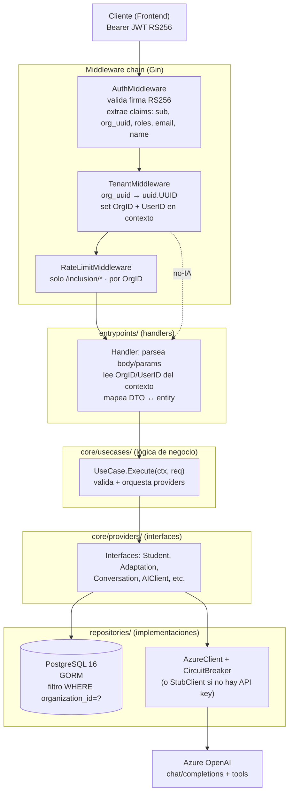
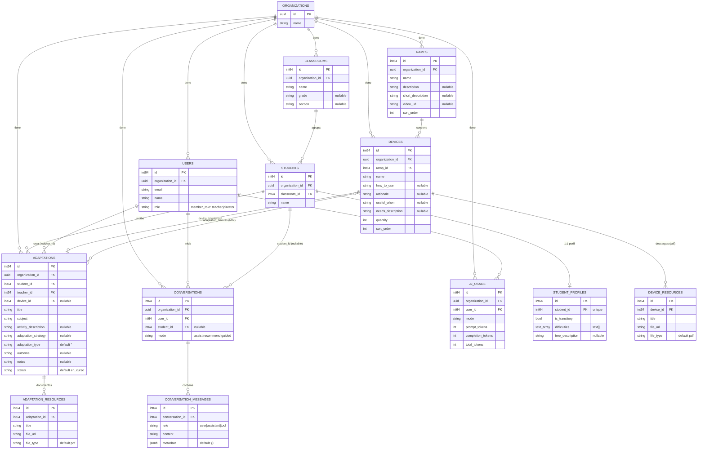
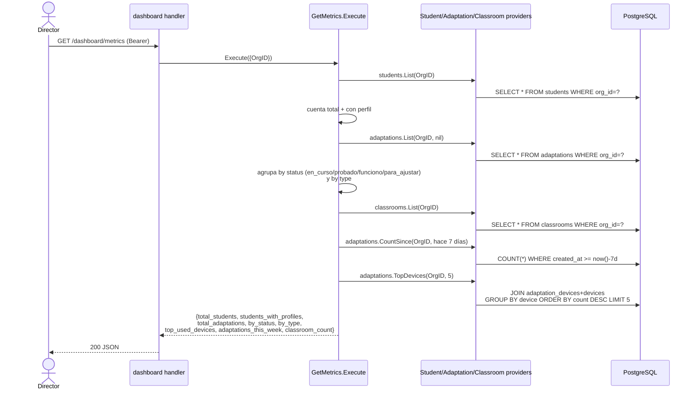
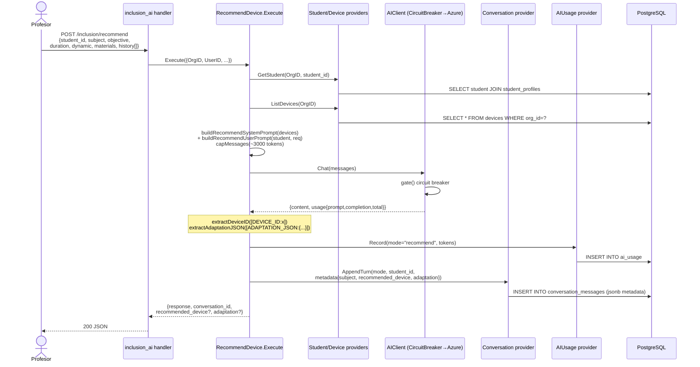
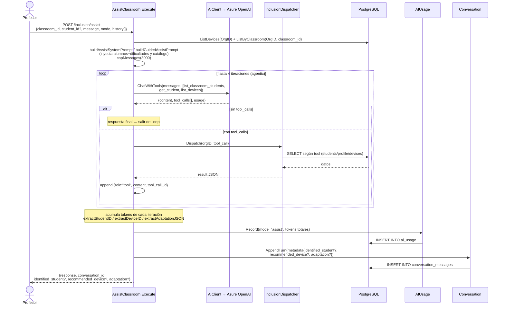
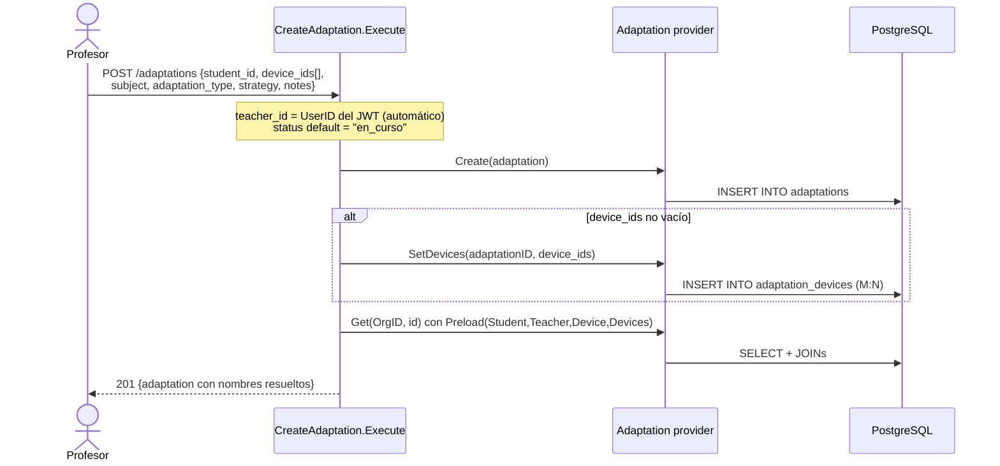

# Diagramas de flujo — Alizia Inclusion BE

> Backend de inclusión educativa de Educabot. Go 1.26 + Gin + GORM + PostgreSQL 16 + Azure OpenAI.
> Clean Architecture: `entrypoints → core/usecases → core/providers ← repositories`.
> Multi-tenant por `organization_id`. Dos roles de producto: **Director** y **Profesor (teacher)**.

Estos diagramas usan [Mermaid](https://mermaid.js.org/). Se renderizan en GitHub, VS Code (con extensión Mermaid) y la mayoría de visores de Markdown.

---

## 0. Arquitectura y pipeline de request

Toda request entra por `/api/v1/*`, pasa por dos middlewares obligatorios (Auth + Tenant) y, en los endpoints de IA, por un rate-limit por organización.



**Roles:** el JWT trae `roles[]`. Hoy el `User.role` en DB distingue `teacher` vs `director`, pero **no hay middleware de autorización por rol**: cualquier usuario autenticado puede llamar cualquier endpoint dentro de su organización. La separación Director/Profesor de abajo es **funcional/de producto**, no está forzada por código (gap de seguridad a considerar).

---

## 1. Modelo de datos (ER) — qué se guarda



**Notas de tenancy:** las tablas "hijas" (`student_profiles`, `device_resources`, `adaptation_resources`, `conversation_messages`) heredan la organización vía su padre; el resto lleva `organization_id` propio y todas las queries filtran por él.

---

## 2. Flujo del DIRECTOR

El director gestiona la estructura institucional (aulas, docentes) y consume métricas agregadas. **No** llama a la IA en su flujo típico; lee resultados que produjeron los profesores.

### 2.1 Mapa funcional + endpoints + tablas

```mermaid
flowchart TB
    D(["👔 DIRECTOR<br/>login → GET /auth/me → role=director"])

    subgraph Aulas["Gestión de aulas"]
        A1["GET /classrooms<br/>listar aulas + conteo alumnos"]
        A2["POST /classrooms<br/>crear aula {name, grade?, section?}"]
        A3["PUT /classrooms/:id<br/>editar"]
        A4["DELETE /classrooms/:id<br/>eliminar"]
        A5["GET /classrooms/:id/students<br/>ver alumnos del aula"]
    end

    subgraph Docentes["Gestión de docentes"]
        T1["GET /teachers<br/>listar usuarios role=teacher"]
    end

    subgraph Tablero["Dashboard / métricas"]
        M1["GET /dashboard/metrics<br/>KPIs institucionales"]
        M2["GET /dashboard/ai-usage?days=N<br/>consumo de tokens IA"]
    end

    subgraph DBd[("PostgreSQL")]
        TC[("classrooms")]
        TS[("students + student_profiles")]
        TU[("users")]
        TA[("adaptations + adaptation_devices")]
        TAI[("ai_usage")]
        TDV[("devices")]
    end

    D --> Aulas
    D --> Docentes
    D --> Tablero

    A1 -->|"SELECT WHERE org_id<br/>Preload Students"| TC
    A2 -->|INSERT| TC
    A3 -->|UPDATE| TC
    A4 -->|DELETE| TC
    A5 -->|"SELECT JOIN profiles<br/>WHERE classroom_id"| TS

    T1 -->|"SELECT WHERE org_id<br/>AND role='teacher'"| TU

    M1 -->|"COUNT/GROUP BY status,type<br/>+ adaptations_this_week<br/>+ top 5 devices"| TA
    M1 --> TS
    M1 --> TC
    M1 --> TDV
    M2 -->|"GROUP BY mode<br/>SUM tokens WHERE created_at>=since"| TAI
```

### 2.2 Detalle de `GET /dashboard/metrics` (qué agrega)



**El director lee, no escribe IA.** Su única escritura es sobre `classrooms` (CRUD). Las métricas se calculan al vuelo desde `students`, `adaptations`, `adaptation_devices`, `ai_usage`.

---

## 3. Flujo del PROFESOR (teacher)

El profesor es el usuario central del producto: registra alumnos y sus perfiles de apoyo, conversa con la IA (Alizia) para planificar/asistir, y materializa adaptaciones que luego puede exportar a PDF.

### 3.1 Mapa funcional + endpoints + tablas

```mermaid
flowchart TB
    P(["🧑‍🏫 PROFESOR<br/>login → GET /auth/me → role=teacher"])

    subgraph Alumnos["Alumnos y perfiles"]
        S1["GET /students?classroom_id=<br/>listar"]
        S2["POST /students<br/>{name, classroom_id}"]
        S3["PUT /students/:id"]
        S4["DELETE /students/:id"]
        S5["GET /students/:id/profile"]
        S6["PUT /students/:id/profile<br/>{is_transitory, difficulties[], free_description?}"]
    end

    subgraph Catalogo["Catálogo (solo lectura)"]
        C1["GET /ramps · /ramps/:id"]
        C2["GET /devices?ramp_id= · /devices/:id"]
    end

    subgraph IA["Asistente IA (Alizia) · rate-limited"]
        AI1["POST /inclusion/recommend<br/>planificación previa"]
        AI2["POST /inclusion/assist<br/>asistencia en vivo (agentic)"]
        AI3["GET /chat/history/:contextId"]
    end

    subgraph Adapt["Adaptaciones"]
        AD1["GET /adaptations?student_id="]
        AD2["POST /adaptations<br/>teacher_id = usuario actual"]
        AD3["PUT /adaptations/:id<br/>status/outcome/notes/devices"]
        AD4["DELETE /adaptations/:id"]
        AD5["GET /adaptations/:id/resources"]
        AD6["GET /adaptations/:id/export?format=pdf|md"]
    end

    subgraph DBp[("PostgreSQL")]
        TS[("students")]
        TSP[("student_profiles")]
        TA[("adaptations")]
        TAD[("adaptation_devices")]
        TCONV[("conversations")]
        TMSG[("conversation_messages")]
        TAI[("ai_usage")]
        TDV[("devices / ramps")]
    end

    Azure["🤖 Azure OpenAI"]

    P --> Alumnos
    P --> Catalogo
    P --> IA
    P --> Adapt

    S1 --> TS
    S2 -->|INSERT| TS
    S3 -->|UPDATE| TS
    S4 -->|DELETE| TS
    S5 -->|SELECT JOIN| TSP
    S6 -->|"UPSERT ON CONFLICT(student_id)"| TSP

    C1 --> TDV
    C2 --> TDV

    AI1 -->|lee perfil+catálogo| TS
    AI1 --> Azure
    AI1 -->|"INSERT turno"| TMSG
    AI1 -->|"INSERT tokens"| TAI
    AI2 -->|"tools: students/devices"| TS
    AI2 --> Azure
    AI2 --> TMSG
    AI2 --> TAI
    AI3 -->|SELECT historial| TCONV
    AI3 --> TMSG

    AD1 --> TA
    AD2 -->|INSERT + M:N| TA
    AD2 --> TAD
    AD3 -->|UPDATE + reset M:N| TA
    AD3 --> TAD
    AD4 -->|DELETE| TA
    AD5 --> TA
    AD6 -->|SELECT+Preload → render PDF/MD| TA
```

### 3.2 Recorrido típico de extremo a extremo

```mermaid
flowchart LR
    A["1. Crea aula/alumno<br/>POST /students"] --> B["2. Carga perfil<br/>PUT /students/:id/profile<br/>(difficulties, is_transitory)"]
    B --> C["3. Planifica con IA<br/>POST /inclusion/recommend<br/>materia + objetivo + alumno"]
    C --> D["4. IA devuelve sugerencia<br/>[DEVICE_ID:x] + [ADAPTATION_JSON:...]"]
    D --> E["5. Materializa adaptación<br/>POST /adaptations<br/>(device_ids, strategy, type)"]
    E --> F["6. Asiste en clase<br/>POST /inclusion/assist (agentic)"]
    F --> G["7. Actualiza resultado<br/>PUT /adaptations/:id<br/>status=funciono, outcome"]
    G --> H["8. Exporta informe<br/>GET /adaptations/:id/export?format=pdf"]
```



### 3.3 Detalle IA — `POST /inclusion/recommend` (planificación, sin tools)



### 3.4 Detalle IA — `POST /inclusion/assist` (asistencia en vivo, AGENTIC con tools)

Este es el flujo más rico: la IA puede pedir datos a la DB mediante *function calling* (hasta 4 iteraciones) antes de responder.



**Tools disponibles (agentic):**
| Tool | Argumentos | Lee de DB |
|------|-----------|-----------|
| `list_classroom_students` | `classroom_id` | `students` del aula |
| `get_student` | `student_id` | `students` + `student_profiles` (dificultades) |
| `list_devices` | — | `devices` (con `useful_when`) |

**Tags que la IA emite en su texto** (parseados por regex en `prompts.go`):
`[STUDENT_ID:x]`, `[DEVICE_ID:x]`, `[ADAPTATION_JSON:{title,type,strategy,device_ids,device_names}]`.
Tipos válidos de adaptación: `actividad_adaptada`, `material_nuevo`, `estrategia_aula`, `situacion_emergente`.

### 3.5 Detalle — `POST /adaptations` (materializar) y export



El **export** (`GET /adaptations/:id/export?format=pdf|md`) solo lee la adaptación con sus preloads y la renderiza (no toca la IA): `renderAdaptationPDF` (fpdf) o `renderAdaptationMarkdown`, con footer *"Generado por Alizia · Educabot · #ID"*.

---

## 4. Resumen comparativo Director vs Profesor

| Dimensión | 👔 Director | 🧑‍🏫 Profesor |
|-----------|-------------|----------------|
| **Objetivo** | Gobernar la institución y medir | Atender alumnos y planificar adaptaciones |
| **Escribe en DB** | `classrooms` (CRUD) | `students`, `student_profiles`, `adaptations`, `adaptation_devices`, `conversations`, `conversation_messages`, `ai_usage` |
| **Lee de DB** | `students`, `adaptations`, `ai_usage`, `devices` (agregados) | `students`, `devices`, `ramps`, `adaptations`, historial de chat |
| **Usa IA** | No (consume métricas de uso) | Sí: `recommend` (simple) y `assist` (agentic con tools) |
| **Endpoints núcleo** | `/classrooms*`, `/teachers`, `/dashboard/*` | `/students*`, `/adaptations*`, `/inclusion/*`, `/chat/history` |
| **Genera tokens IA** | — | Sí, registrados en `ai_usage` por `mode` |
| **Salida típica** | KPIs JSON (tablero) | Adaptación materializada + export PDF |

---

## 5. Notas e implicancias

- **Sin RBAC en código:** la columna `users.role` existe pero ningún middleware la verifica. La división Director/Profesor es de producto; técnicamente un teacher puede crear aulas y un director puede crear adaptaciones. Si se requiere separación dura, falta un `RoleMiddleware`.
- **Resiliencia IA:** `CircuitBreaker` envuelve a `AzureClient`; tras N fallos consecutivos abre el circuito y rechaza llamadas durante un cooldown. Si no hay API key configurada, se usa `StubClient` (dev).
- **Control de costos:** `capMessages` recorta el historial a ~3000 tokens antes de cada llamada; `ai_usage` registra prompt/completion/total por request y `mode`, lo que alimenta `/dashboard/ai-usage`.
- **Persistencia de la conversación:** cada turno de IA guarda un `conversation_message` con `metadata` JSONB que puede incluir `identified_student`, `recommended_device` y `adaptation` (la sugerencia estructurada que el frontend puede convertir en `POST /adaptations`).
```

