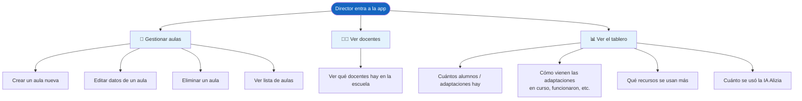
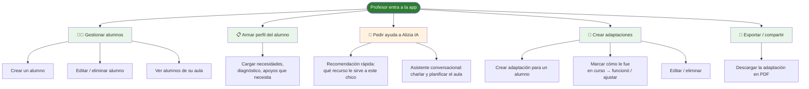
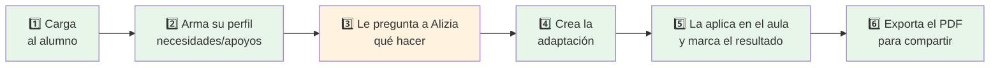
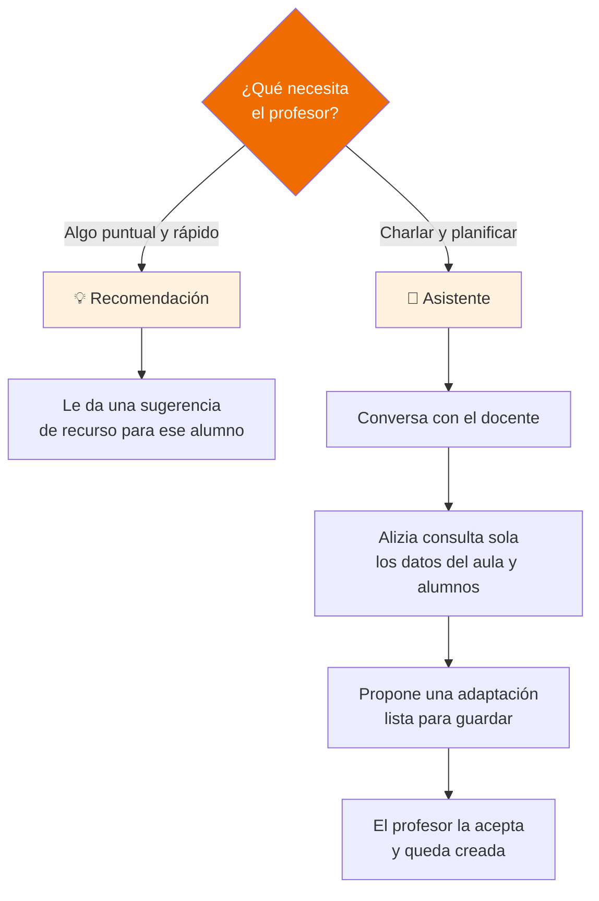

# Flujos de producto — Director y Profesor

> Visión **funcional / de usuario**. Qué puede hacer cada rol, qué ve y cómo se mueve por la app.
> Sin detalle técnico ni de base de datos.

---

## 🧭 En una frase

- **Director** → mira y organiza. Crea las aulas, ve a los docentes y consulta cómo va todo (tablero con números).
- **Profesor** → trabaja el día a día. Carga a sus alumnos, les arma el perfil, planifica con ayuda de la IA (Alizia) y crea las adaptaciones para cada chico.

---

## 👔 DIRECTOR — Qué puede hacer

### Su día típico
1. Entra y ve el **tablero general** de la escuela.
2. Si arranca un ciclo nuevo, **crea las aulas**.
3. Revisa **qué docentes** están cargados.
4. Cada tanto mira los **números**: cuántas adaptaciones se hicieron, cómo van, cuánto se apoyó el equipo en la IA.

**El director NO crea alumnos ni adaptaciones.** Su rol es organizar y supervisar.

---

## 👩‍🏫 PROFESOR — Qué puede hacer

### Su día típico (recorrido completo)

---

## 🤖 Cómo funciona la ayuda de Alizia (IA) — para el Profesor

Alizia tiene **dos modos**, según lo que necesite el docente:

- **Recomendación** → respuesta rápida tipo "para este chico te sirve tal recurso".
- **Asistente** → es una conversación. Alizia entiende el contexto del aula, propone una adaptación concreta y el docente la puede guardar de una.

---

## ⚖️ Director vs Profesor — de un vistazo

| | 👔 Director | 👩‍🏫 Profesor |
|---|---|---|
| **Foco** | Organizar y supervisar | Trabajar con cada alumno |
| **Crea aulas** | ✅ Sí | ❌ No |
| **Ve docentes** | ✅ Sí | — |
| **Crea alumnos** | ❌ No | ✅ Sí |
| **Arma perfiles** | ❌ No | ✅ Sí |
| **Usa la IA Alizia** | ❌ No (solo ve cuánto se usó) | ✅ Sí, es su herramienta clave |
| **Crea adaptaciones** | ❌ No | ✅ Sí |
| **Exporta PDF** | — | ✅ Sí |
| **Ve el tablero con números** | ✅ Sí | — |

---

## 📌 Nota importante sobre los roles

Hoy la app **no bloquea por rol técnicamente**: cualquier usuario logueado podría, en teoría, entrar a las pantallas del otro. La separación "Director hace esto / Profesor hace esto otro" es **de producto y de cómo se diseñó la experiencia**, no una restricción forzada por el sistema.

> Si el negocio necesita que un profesor **no pueda** tocar lo del director (o viceversa), eso hay que pedirlo como una funcionalidad a agregar.
